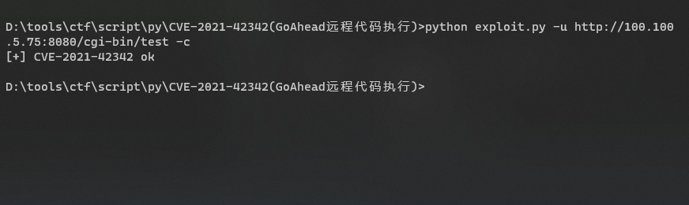
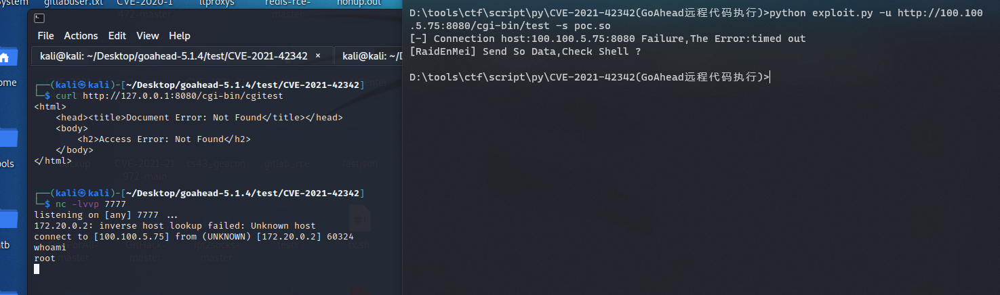

## CVE-2021-42342 ##
利用要求  
1.cgi-bin开启  
2.找到cgi-bin脚本  
3.文件描述符不会炸(/proc/self/fd/7)  

```text
Example:
python exploit.py -u <url> -c #检测漏洞
python exploit.py -u <url> -s poc.so #指定so利用

Usage: exploit.py [options]

Options:
  -h, --help  show this help message and exit
  -u URL      检测的url
  -s SO       指定so
  -c          检测是否存在漏洞
```




## 参考链接 ##
POC:https://github.com/Mr-xn/CVE-2021-42342  
docker:https://raw.githubusercontent.com/vulhub/vulhub/master/goahead/CVE-2021-42342/docker-compose.yml  
漏洞分析:https://mp.weixin.qq.com/s/AS9DHeHtgqrgjTb2gzLJZg  