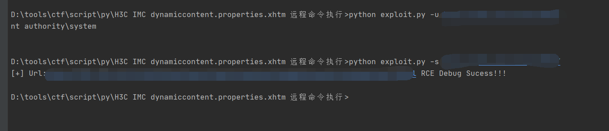

## H3C IMC dynamiccontent.properties.xhtm 远程命令执行 ##
原文链接:https://mp.weixin.qq.com/s/BP9_H3lpluqIwL5OMIJlIw  
fofa搜索语法
```text
body="/imc/javax.faces.resource/images/login_help.png.jsf?ln=primefaces-imc-new-webui"
```

* command.txt - 要执行的命令
* scanner.txt - 漏洞验证测试

```text
Usage:
python exploit.py -u <url> #RCE
python exploit.py -u <url> #Testing Bug
Usage: exploit.py [options]

Options:
  -h, --help  show this help message and exit
  -u URL      Exec Command Url
  -s SCANNER  Scann Bug Url
```


