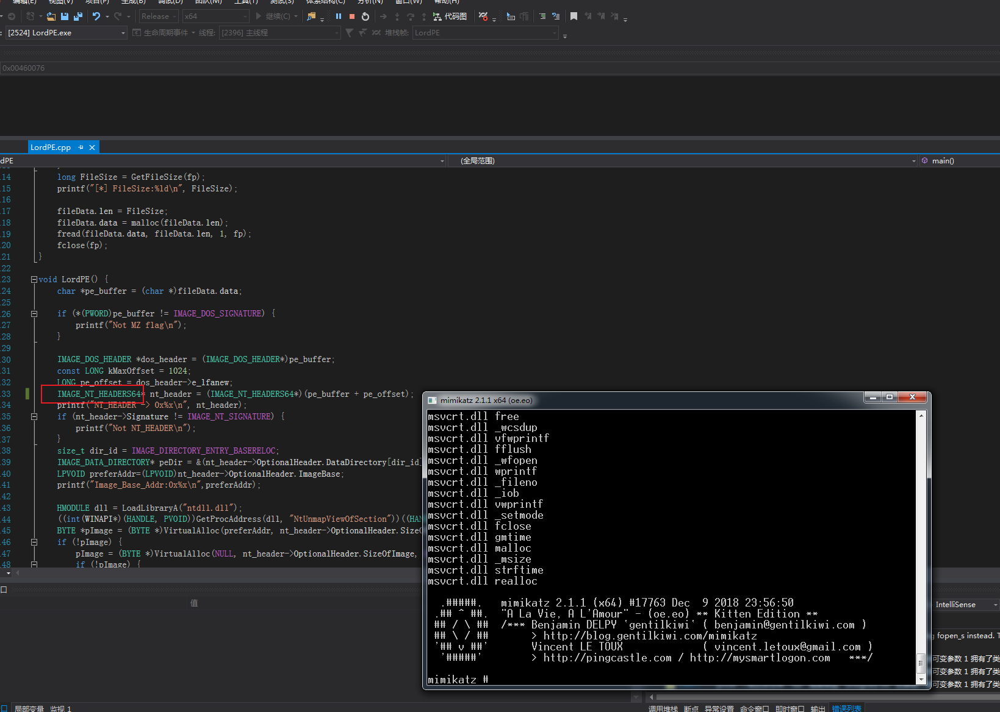
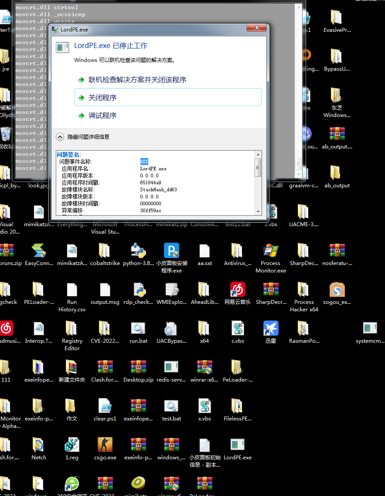
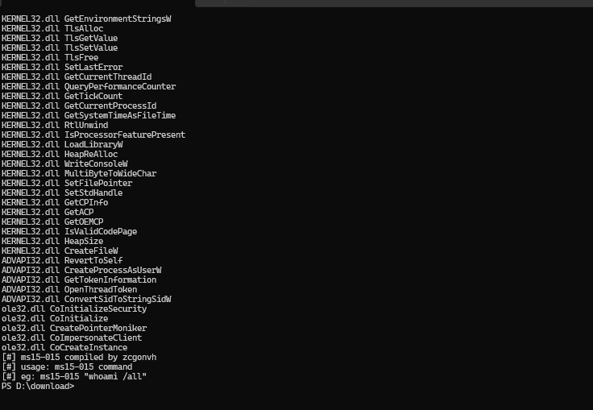
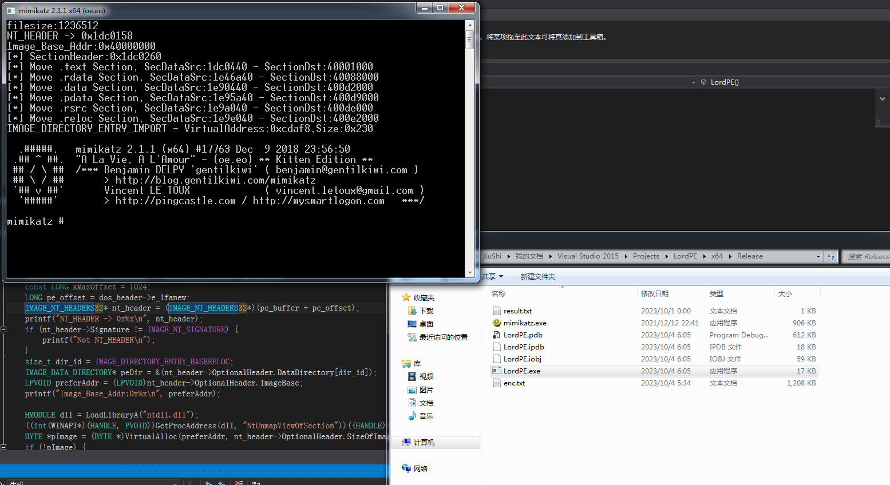

## LoadPE ##
名字都打错且照抄的项目，纯粹为了学习LoadPE的过程    
抄袭于:https://github.com/TheD1rkMtr/FilelessPELoader/tree/main    


```txt
0.从文件中获取pe头
    0.1 使用NtUnmapViewOfSection函数在内存清空对应PE基址数据 (取消映射当前区段)
1.根据nt的optionheader头，去判断需要申请多少内存空间。根据ImageBaseAddress，判断申请内存的基址
2.从dos头开始，将dos+nt 拷贝到内存中。
3.区段对应的数据从PE拷贝到分配的内存中（需要计算：RVA、FOA）
    pImage(vt分配的内存空间)+SectionHeader[i].VirtualAddress -> 拷贝dst
    pe_buffer+SectionHeader[i].PointerToRawData -> 拷贝src
4.DLL导入表获取逐个用GetProcess(LoadLibraryA(DLL_NAME),API_NAME)
    根据对应的PE是否要自定义API函数重构 (利用部分传参API函数)
5.获取PE文件加载到内存时相对于镜像基址的入口点地址 -> 在分配的内存里找到PE入口点，(size_t)(pImage)+nt_header->OptionalHeader.AddressOfEntryPoint
6.使用汇编/jmp命令/回调的方式实现跳转执行
```

要修改回x86只需要改PE类型改为32即可，即:IMAGE_NT_HEADERS32







