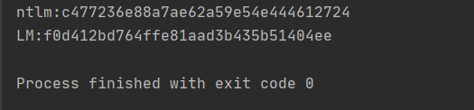

## Ntlm | LM ##

NTLM hash加密过程：
 1.字符串16进制编码
 2.16进制编码结果进行unicode编码 (这里的unicode编码=每两个16进制的字符串后面加2个0)
 3.unicode编码结果进行md4加密

LM hash加密过程：
 1.将小写的[a-z]转换为大写 => a
 2.(a)转换为大写后将其hex编码 => b
 2.(b)hex编码后长度不为48bit，将其填充到112bit => c
 3.(c)将114bit编码的结果分成两组56bit => d
 4.(d)将两组56bit进行转换为二进制 => e
 	(d)如果这两组不够56bit，转换为二进制后在左边填充足够的0到达56bit

 5.(e)将比特流按照7比特一组，分出8组，末尾加0 => f (2个8组的bit流)
 6.(f)将这8组bit流转换为16进制（每4位bit=1位十六进制）=> g
 7.(g)将两组的十六进制进行二进制的hex编码（返回由十六进制字符串 hexstr 表示的二进制数据（binascii.hex_a2b））=> h
 8.(h)将两组二进制hex编码的字符串，当作key对魔术字符串KGS!@#$%进行des编码，然后拼接两者得到LM hash

 参考链接:
 https://blog.csdn.net/endeav_or/article/details/50196325
 https://payloads.online/archivers/2018-11-30/1#ntlm-%E5%8D%8F%E8%AE%AE
