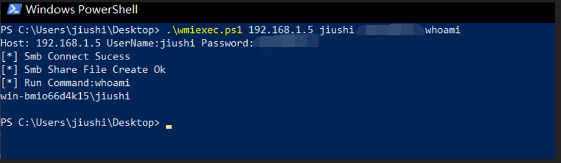
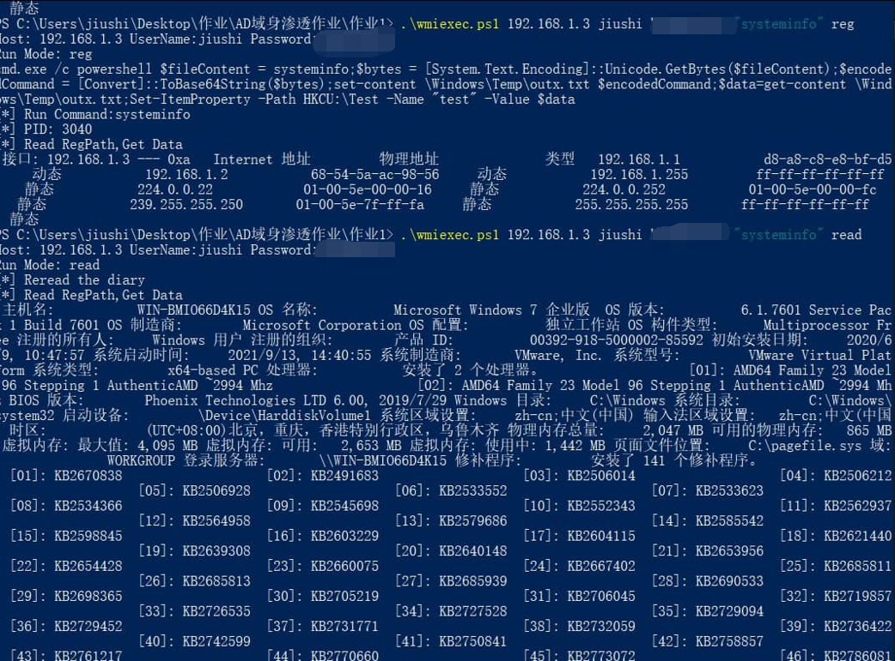
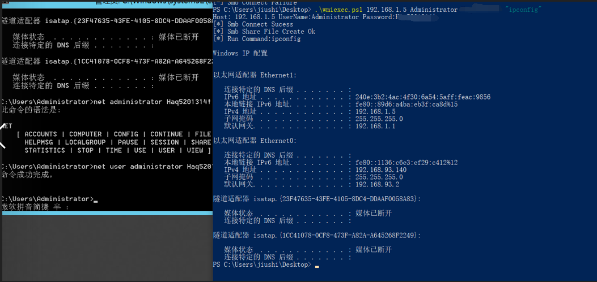
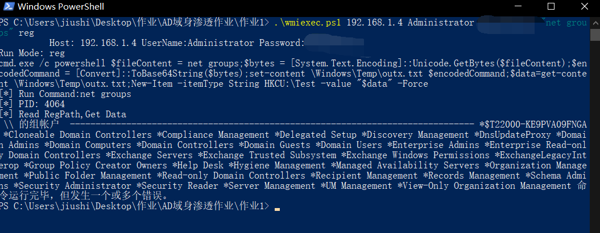
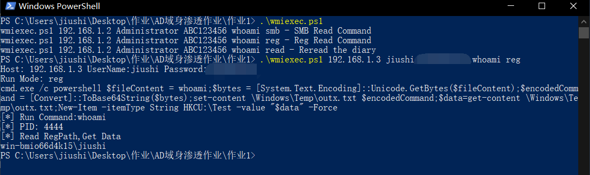

一个作业，要求了解wmiexec怎么实现的，想着理解。那powershell写了一个
```
wmiexec.ps1 192.168.1.2 Administrator ABC123456 whoami smb - SMB Read Command
wmiexec.ps1 192.168.1.2 Administrator ABC123456 whoami reg - Reg Read Command
wmiexec.ps1 192.168.1.2 Administrator ABC123456 whoami read - Reread the diary
```










