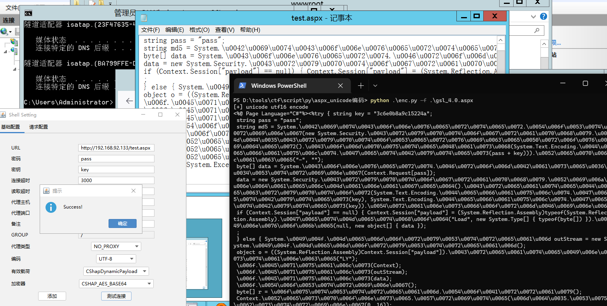
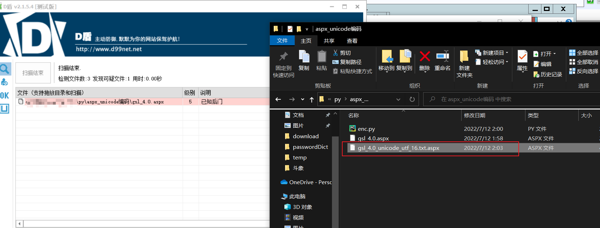

## webshell unicode编码##
unicode编码支持的字符集:
 - [x] UTF-16
 - [ ] UTF-32
 
 待补充
 参考链接:https://forum.butian.net/share/1729  

```text
usage:python enc.py -f <webshell_path>
Usage: enc.py [options]

Options:
  -h, --help  show this help message and exit
  -f FILE     要编码的webshell文件
```

