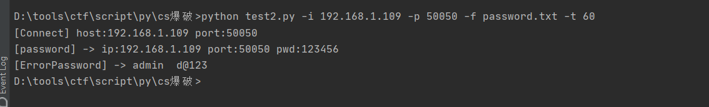
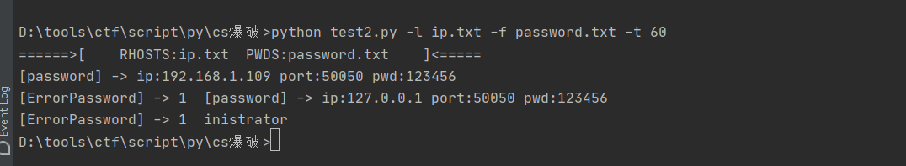

## cs check password ##

看文章然后改的  

指纹:  FOFA:`Cobalt strike && port="50050""`  

关键点:
* SSL连接
* 密码正确返回`\x00\x00\xCA\xFE`
* 密码错误返回`\x00\x00\x00\x00`
```text
usage: test2.py [-h] [-i IP] [-p PORT] [-f FILE] [-l IPLIST] [-t THREAD]

optional arguments:
  -h, --help            show this help message and exit
  -i IP, --ip IP        set rhost
  -p PORT, --port PORT  set rport
  -f FILE, --file FILE  set password file
  -l IPLIST, --iplist IPLIST
                        set rhosts file,Example:test.txt -> 127.0.0.1:50050
  -t THREAD, --thread THREAD
                        set thread/process,default:30
Example:
python test2.py -i 127.0.0.1 -p 50050 -f password.txt -t 60
python test2.py -l ip.txt -f password.txt -t 60
```

  

  

原文链接:  
[蓝色吃定红色-爆破CS Teamserver 密码 ](https://mp.weixin.qq.com/s?__biz=MzIzODE0NDc3OQ==&mid=2247483812&idx=1&sn=2bf03bd09a54951483e9e5ba7a06a416&chksm=e93c9dc0de4b14d652e0e9b1f038231b7096d44d028239741ad2198f172bcdb8f1037d9b4de1&mpshare=1&scene=23&srcid=0918ADHMyI50Rd2XzgkwpAPM&sharer_sharetime=1600429997267&sharer_shareid=64458b89777349122de4fc747d336e14#rd)