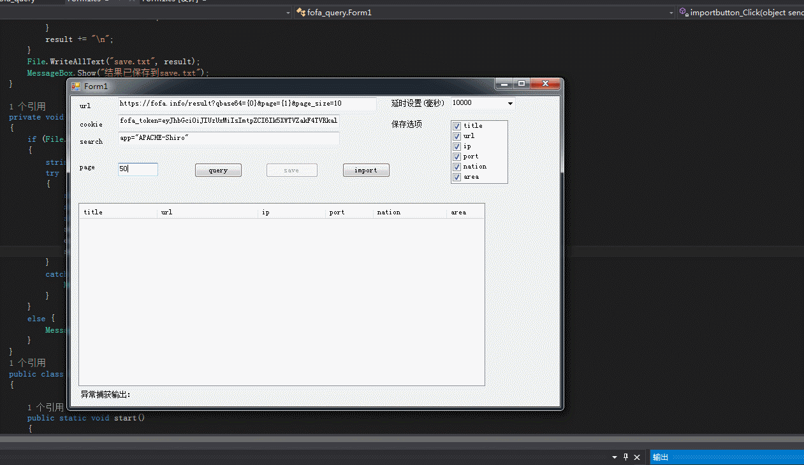

fofa_query
需要.NET环境:.NET4.5
* 采用HttpClient和异步爬取
* 多页面爬取需要设置延迟，默认10秒



config.txt格式
```
[url]=<fofa_url格式> #默认[url]=https://fofa.info/result?qbase64={0}&page={1}&page_size=10
[cookie]=<登录后的cookie>
[search]=<fofa搜索内容>
```

按钮介绍
* import 从当前目录读取config.txt导入配置
* query 开始爬取
* clear 爬取后的结果清空
* save保存文件