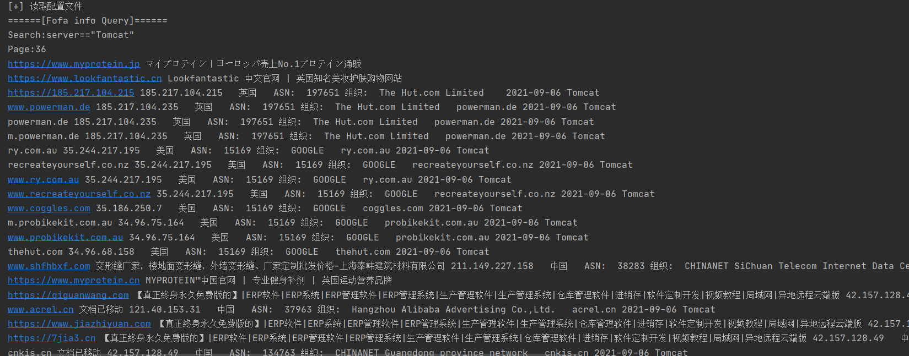

## fofa数据获取 ##
之前写的不能用了，直接重构一个算了 （
config.py
```python
url="https://fofa.so/result?qbase64={search}&page={page}&page_size=10" #fofa爬取数据的url
search=open("search.txt","r",encoding="utf-8").read() #搜索语法读取 (不支持多行)
page=36 #要爬取的页数
max=30 #一次进程处理的页数
process=10 #进程最大设置
filename="停車場管理系統.txt" #保存文件设置
cookie="" #fofa登录后的cookie
```

为了防止请求频繁出现503导致爬不到数据的情况，在503状态码返回时会延时5秒进程重新爬取
