```text
Usage:
python wmi_query -i <target> -u <username> -p <password> -g #Get Process List
python wmi_query -i <target> -u <username> -p <password> -g -q #query Av/EDR/Process
python wmi_query -i <target> -u <username> -p <password> -U #User Query
python wmi_query -i <target> -u <username> -p <password> -R 1 #Enable rdp
python wmi_query -i <target> -u <username> -p <password> -R 0 #Disable rdp
python wmi_query -i <target> -u <username> -p <password> -E 1 #Enable PTH rdp
python wmi_query -i <target> -u <username> -p <password> -E 0 #Disable PTH rdp
python wmi_query -i <target> -u <username> -p <password> -W 1 #Enable winrm service
python wmi_query -i <target> -u <username> -p <password> -F query # query all Firewall rule
python wmi_query -i <target> -u <username> -p <password> -F query1 #query Enable Firewall rule
python wmi_query -i <target> -u <username> -p <password> -F query2 #query Disable Firewall rule
python wmi_query -i <target> -u <username> -p <password> -F querya #query inbound Firewall rule
python wmi_query -i <target> -u <username> -p <password> -F queryb #query outbound Firewall rule
python wmi_query -i <target> -u <username> -p <password> -F query1a #query Enable inbound Firewall rule
python wmi_query -i <target> -u <username> -p <password> -F query2a #query Disable inbound Firewall rule
python wmi_query -i <target> -u <username> -p <password> -F query1b #query Enable outbound Firewall rule
python wmi_query -i <target> -u <username> -p <password> -F query2b #query Disable outbound Firewall rule
python wmi_query -i <target> -u <username> -p <password> -F query3 #query InstanceID Firewall rule
python wmi_query -i <target> -u <username> -p <password> -F delete #delete InstanceID Firewall rule
python wmi_query -i <target> -u <username> -p <password> -F disable #Disable a firewall rule
python wmi_query -i <target> -u <username> -p <password> -F enable #Enable a firewall rule
python wmi_query -i <target> -u <username> -p <password> -f query #query Firewall
python wmi_query -i <target> -u <username> -p <password> -f stop #stop Firewall
python wmi_query -i <target> -u <username> -p <password> -F start #start Firewall

Usage: wmi_query.py [options]

Options:
  -h, --help          show this help message and exit
  -i IP               target IP
  -u USERNAME         auth username
  -d DOMAIN           target domain
  -p PASSWORD         auth password
  -n NTLM             auth ntlm/lm
  -g                  get process list
  -q                  query Av/EDR/Process
  -U                  user list query
  -R ENABLE_RDP       enable rdp/disable rdp
  -E ENABLE_PTH       enable rdp pth login
  -W ENABLE_WINRM     enable winrm service
  -F NETFIREWALLRULE  Query/Enable/Disable NetFirewallRule
  -f FIREWALL         Start/Stop firewall
```

## get process list ##
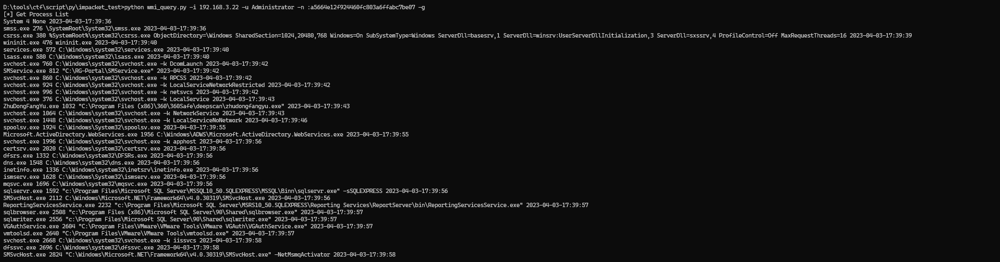

## Query Antivirus/EDR ##
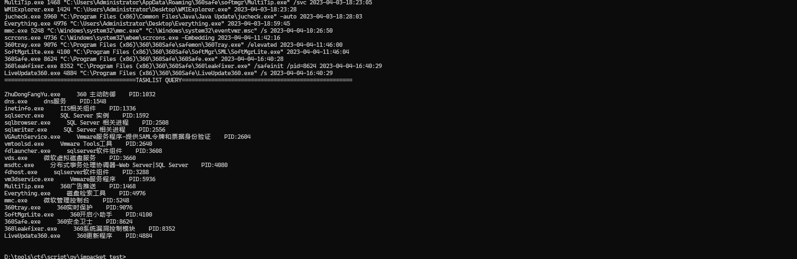

## Users Query ##
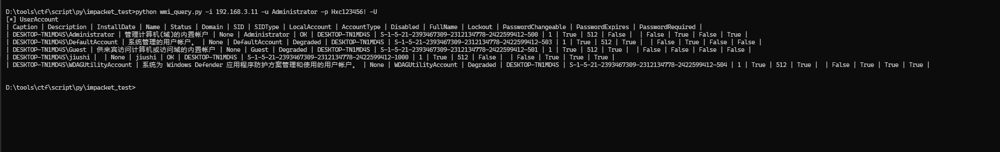

## Enable/Disable Rdp ##
Disable RDP    
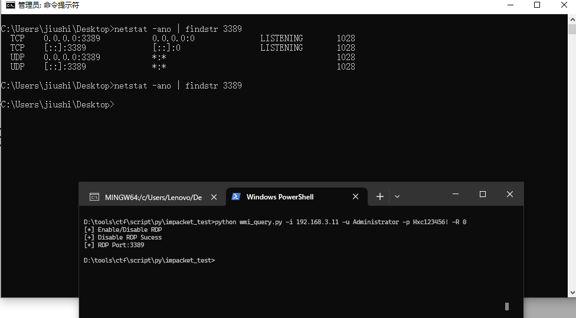

Enable RDP    


## Enable/Disable PTH rdp ##
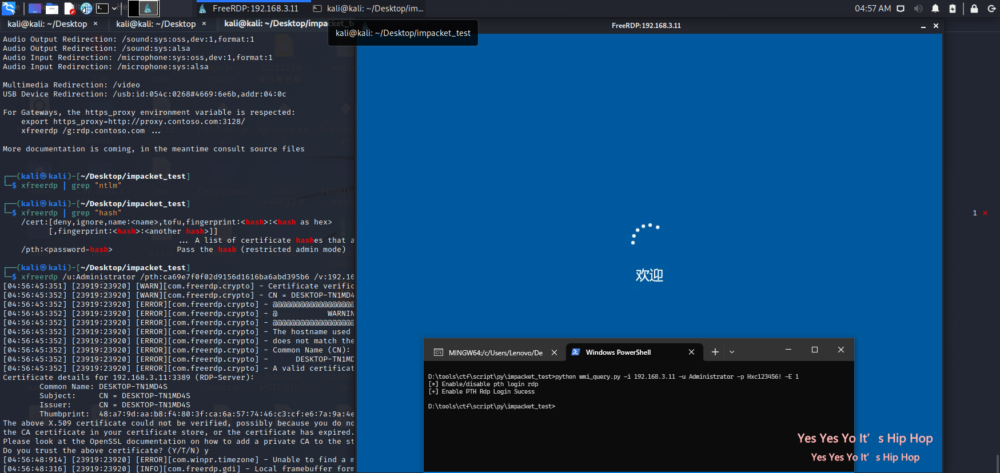

**Windows7/Windows Server 2008,Not Found //./root/StandardCimv2 NameSpace
Unable to configure firewall rules**    

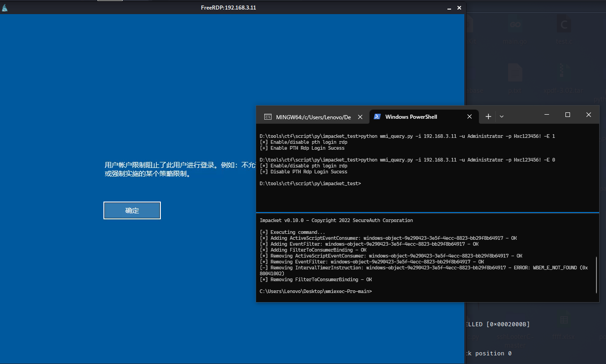

## Enable/Disable winrm Service ##
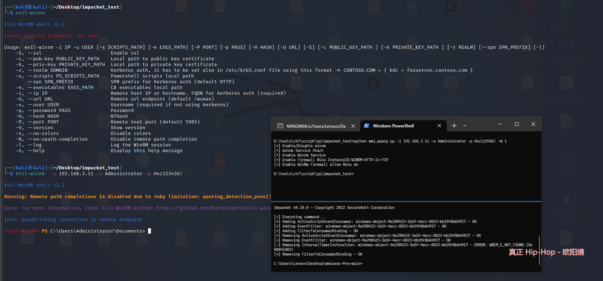

the Firewall Name set spance   
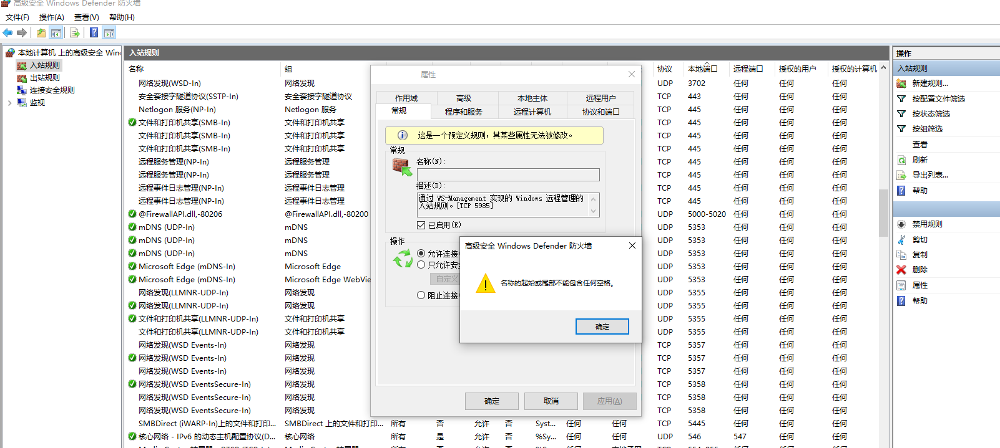

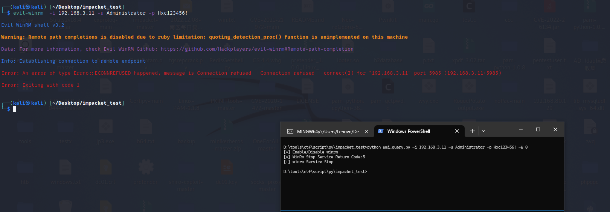

## Firewall rule setting ##
query all Firewall rule    


query Enable Firewall rule    
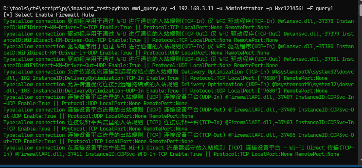

query Disable Firewall rule    
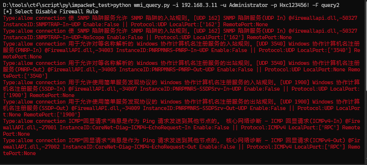

query inbound Firewall rule    
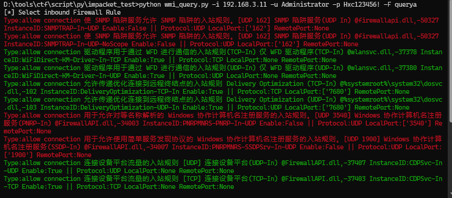

query outbound Firewall rule    
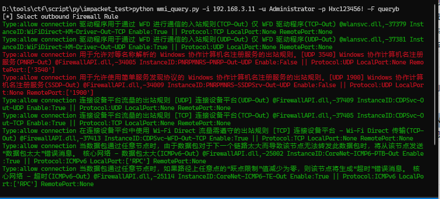

query Enable inbound Firewall rule    
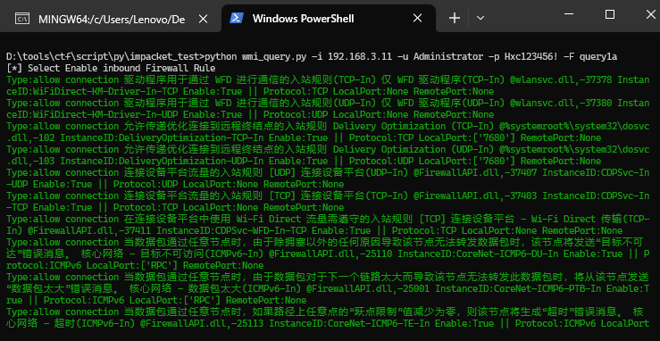

...........    

query InstanceID Firewall rule     
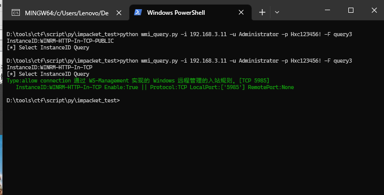

enable/disable Firewall rule    
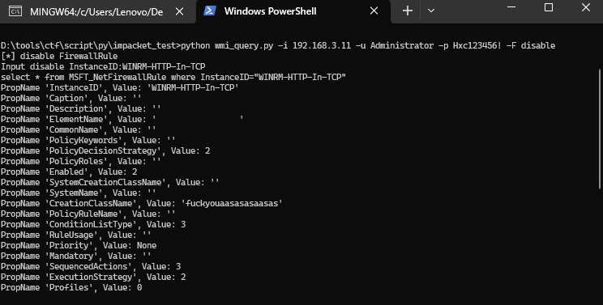

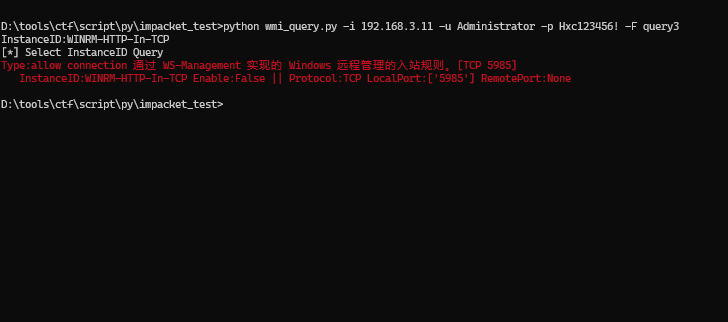


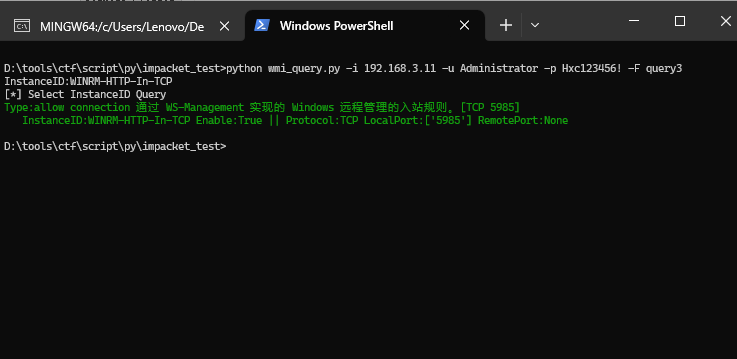

## Firewall setting ##
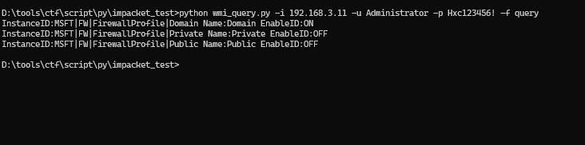

start/stop Firewall    
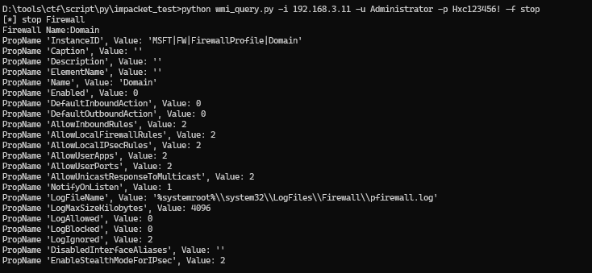

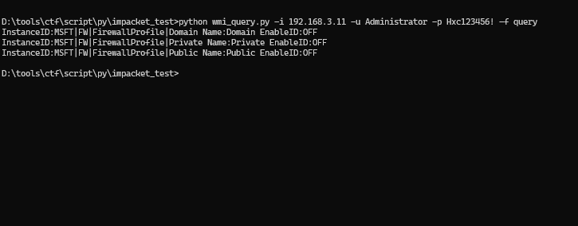

纯属写来练手,感谢离爹提供的帮助，推荐小离的项目:https://github.com/XiaoliChan/wmiexec-Pro    
