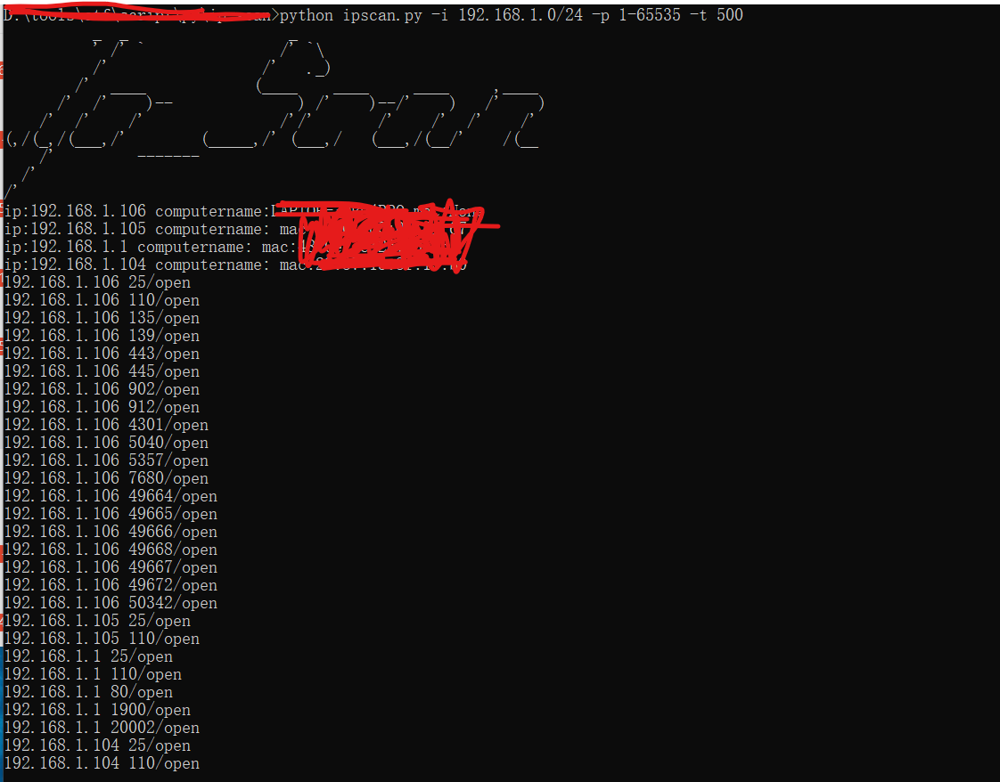

## Ipscan ##
功能:
- [x] 探测ip存活
- [x] 扫描指定的端口（能获取banner的获取banner）
- [x] Netbios获取
- [x] 获取Mac地址

```text
          _  _                  _
          ' /' `               /' `\
          /'                 /'   ._)
        /'  ____            (____    ____     ____     ,____
      /'  /'    )--              ) /'    )--/'    )   /'    )
    /'  /'    /'               /'/'       /'    /'  /'    /'
(,/(_,/(___,/'        (_____,/' (___,/   (___,/(__/'    /(__
    /'         -------
  /'
/'
Usage: ipscan.py [options]

Options:
  -h, --help        show this help message and exit
  -i IPLIST         setting scan ip
  -p PORTLIST       setting port
  -t PROCESSTHREAD  Concurrent condition settings
```

Eaxmple:
```text
python ipscan.py -i 192.168.1.0/24 -p 1-1000 -t 300
```

