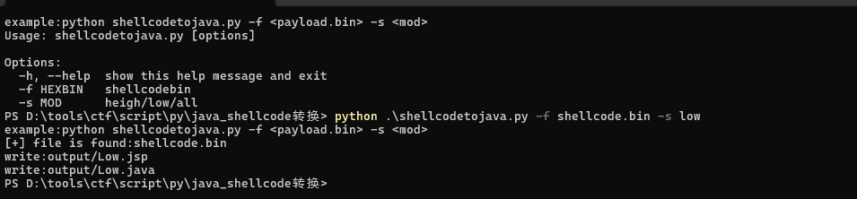
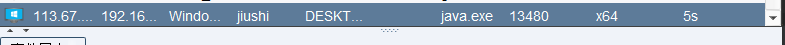

## javashellcode转换 ##
```text
example:python shellcodetojava.py -f <payload.bin> -s <mod>
Usage: shellcodetojava.py [options]

Options:
  -h, --help  show this help message and exit
  -f HEXBIN   shellcodebin
  -s MOD      heigh/low/all
```
生成bin文件，jdk1.8<= low,j>ava1.8 heigh,all高低适配



目录:
* output输出文件
* poc模板文件

生成的文件适用平台:windows

效果:  
