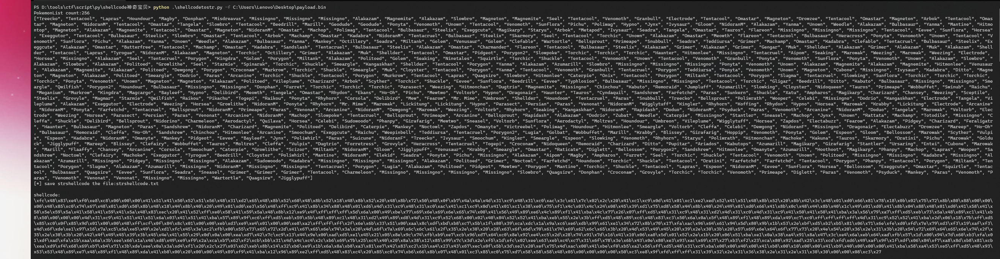
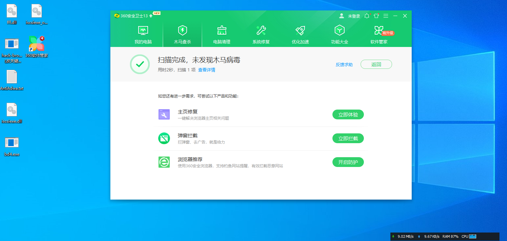

## shellcode神奇宝贝加载器 ##
原项目来源于：https://github.com/Techryptic/Pokemon-Shellcode-Loader  

自己改进了一下
```text
Usage: shellcodetostr.py [options]

Options:
  -h, --help  show this help message and exit
  -f FILE     指定shellcode bin文件
python shellcodetostr.py -f <raw_shellcode_bin>
```

输出有两个文件:
* hexshellcode.txt #hex后的shellcode  
* strshellcode.txt #神奇宝贝名称的数组  



360测试  



defender测试  


cs上线测试  
