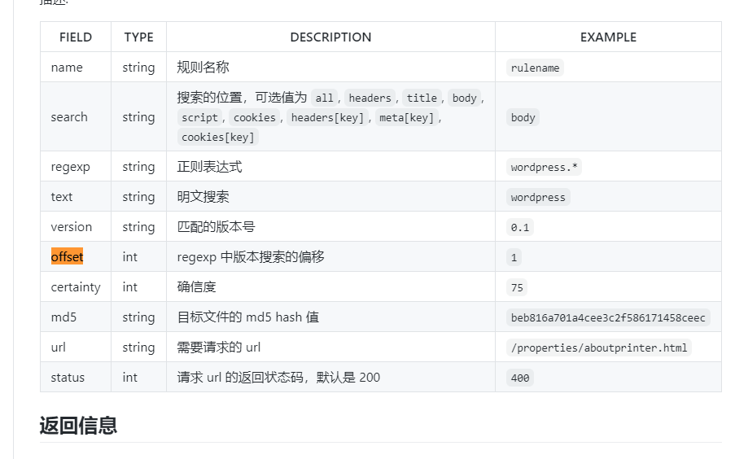
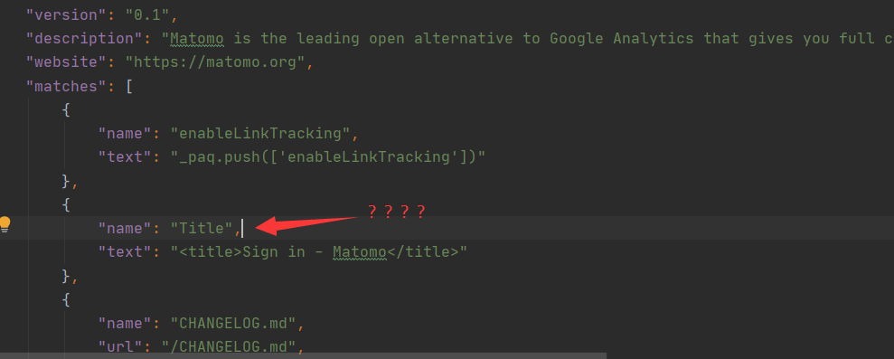
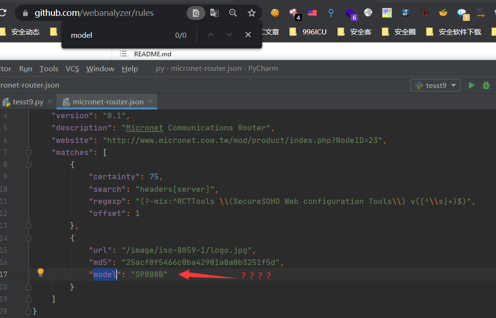
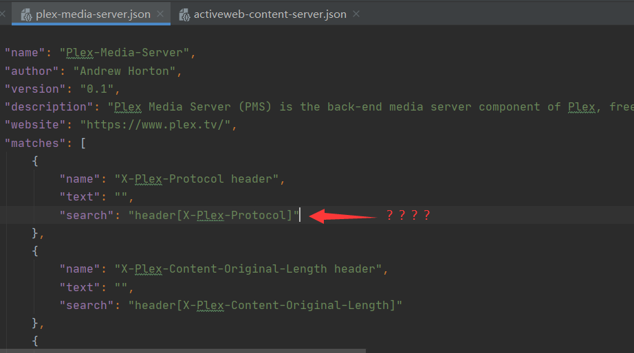
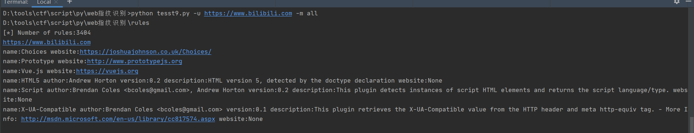
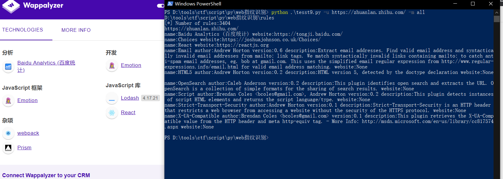
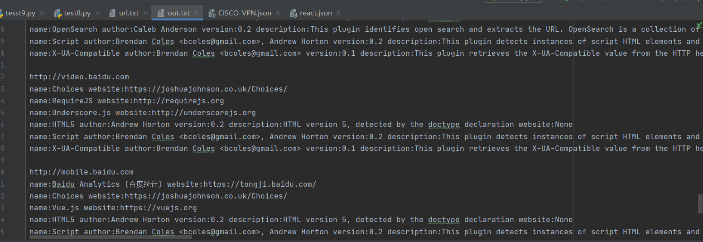

## web指纹识别 ##
之前想过弄这个，后面发现这规则全是全。但是有些不按规范写的导致难处理，今天写了一下午的容错处理。


指纹库来源:https://github.com/webanalyzer/rules   
(长期使用请自行更新)

(一些错误规范的规则)  






## 运行测试 ##
所有规则进行搜索    




指定规则(需要指定绝对路径)  


指定txt  


```text
python webinfo.py -u <url> -m all or python webinfo.py -u <url> -m <path>
python webinfo.py -f <file> -m all or python webinfo.py -f <file> -m <path>
Usage: tesst9.py [options]

Options:
  -h, --help  show this help message and exit
  -u URL      Specify URL
  -f FILE     Specify file
  -m MODEL    Mode setting
```

默认过滤设置(注释掉的代表不使用)  
```python
        self.searchconfig=[['regexp'], #ok
                           ["search","text"], #ok
                           ['search', 'regexp'], #ok
      #                     ['md5', 'url'], #ok
      #                     ['url', 'md5'], #ok
       #                    ['url', 'md5', 'model'], #ok
                           ['search', 'regexp', 'offset'], #ok
                           ['status', 'text'], #ok
                           ['name', 'regexp', 'search'], #ok
                           ['name', 'search', 'regexp', 'offset'], #ok
                           ['search', 'regexp', 'name']] #规则过滤配置
```

使用all时要排除的规则库  
```python
  self.rulesexclude=["custom","fofa"] #规则库排除
```
