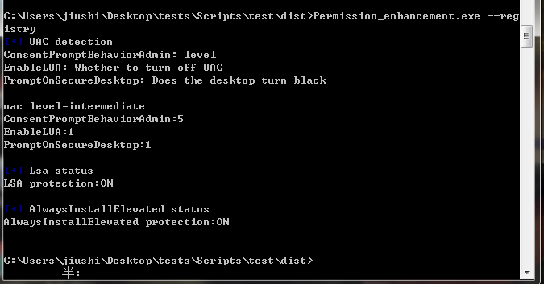
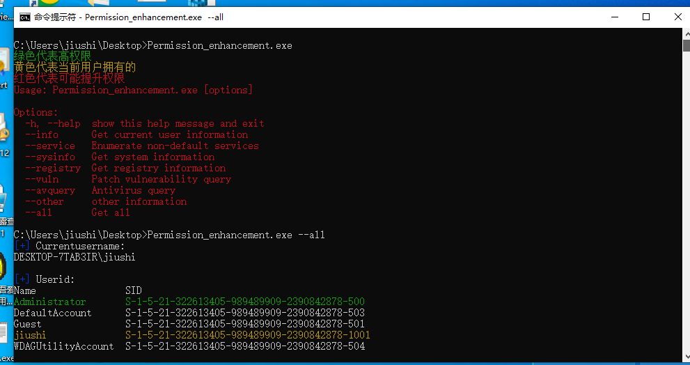
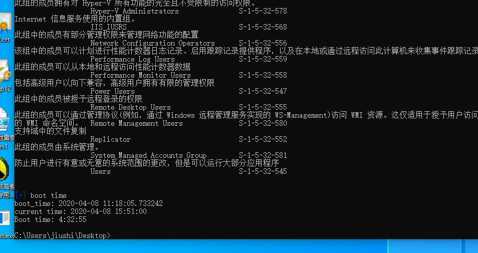
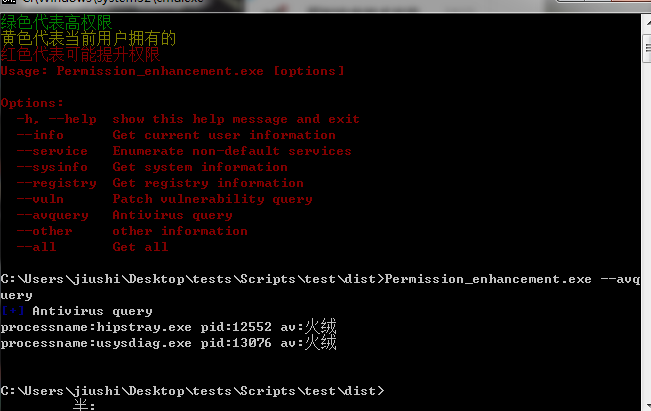
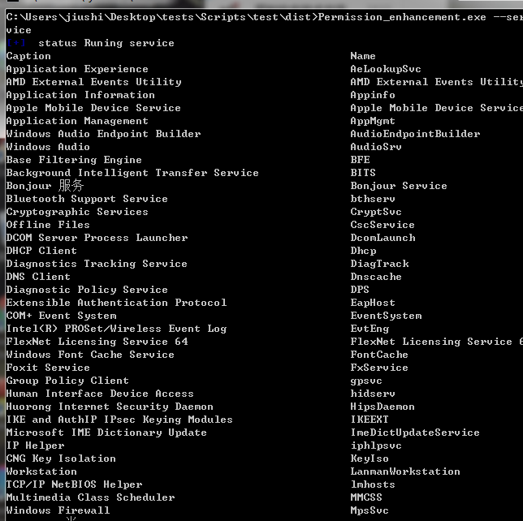
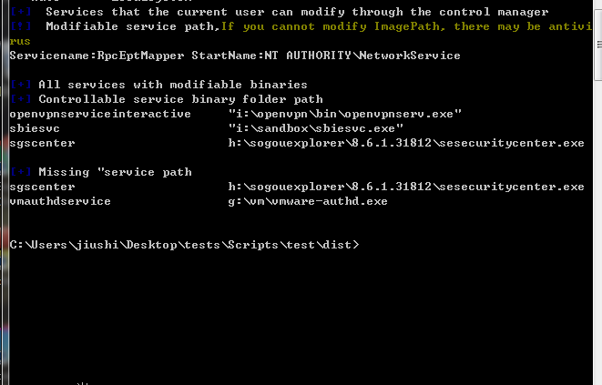

## Permission_enhancement ##
功能：
* 获取当前用户信息 
* 获取当前用户的用户名和SID 
* 枚举当前用户所属的组（默认组合低特权组除外） 
* 枚举潜在高权限用户的令牌
* 获取目标设备服务
* 枚举正在运行的服务
* 枚举当前用户可以通过控制管理器修改的服务
* 枚举具有可修改二进制文件（或参数）的所有服务
* 枚举具有可以利用的未引用路径的服务
* 枚举安装的程序
* 检查是否启用了UAC（用户访问控制）
* 检查是否启用了LAPS（本地管理密码解决方案）
* 杀软判断
* 未打补丁的exp列出
* 检查目标设备的上次更新时间
* 所有的用户组
* 目标系统开机时间
* 驱动信息
* 网络信息

```
>Permission_enhancement.exe
绿色代表高权限
黄色代表当前用户拥有的
红色代表可能提升权限
Usage: Permission_enhancement.exe [options]

Options:
  -h, --help  show this help message and exit
  --info      Get current user information
  --service   Enumerate non-default services
  --sysinfo   Get system information
  --registry  Get registry information
  --vuln      Patch vulnerability query
  --avquery   Antivirus query
  --other     other information
  --all       Get all

```












