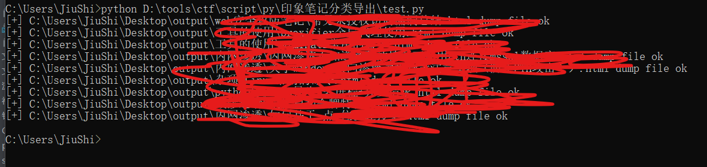
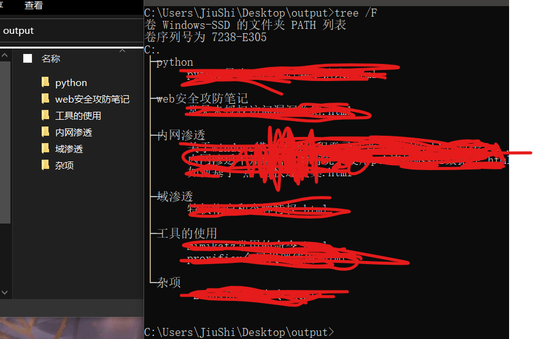

## 印象笔记enex分类导出 ##
由于国际局势不稳定，说不定那天厂商就完蛋了。印象笔记又不搞个自动按照标签导出分类，只能自己写了

**导出方法：全部笔记ctrl+A选择，选择enex格式导出**

使用方式：
```python
FILEPATH=r"C:\Users\JiuShi\Desktop\Evernote [2].enex" #单个文件或文件夹路径
OUTPUTFILE=r"C:\Users\JiuShi\Desktop\output"
NUMBER=500 #信息量过大时，数量到一定程度并发
```

导出结果如下




缺点：不支持导出附件，附件会作为图片放入html里
