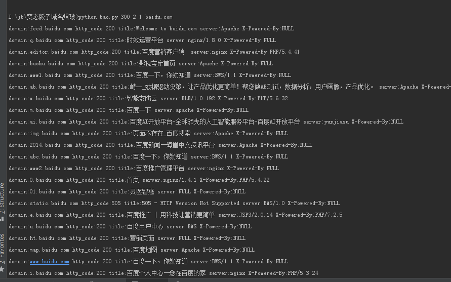
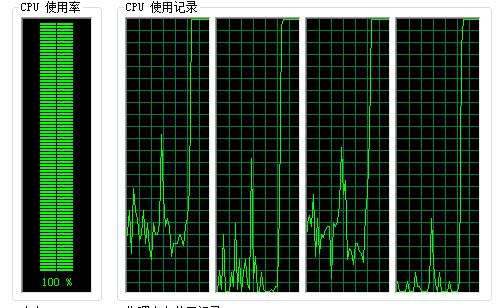
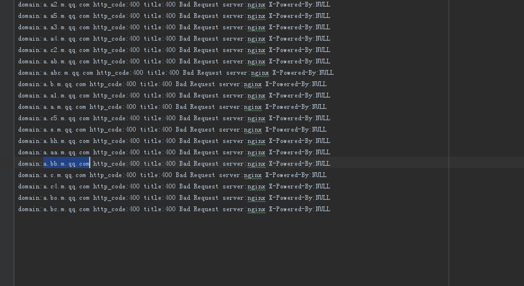

# 变态版子域名爆破
- [x] 从指定的字段文件夹获取子域
- [x] 允许用户调度任务数量
- [x] 实现指定爆破二级域名或三级域名等
- [x] DNS解析和HTTP请求以及HTTPS请求来验证域名的存活性标题名也获取了,headers也获取了吧


使用说明：
```text
python bao.py [number] [level] [sleeps] [domain]
例如:python bao.py 100 2 0.003 baidu.com
```
* number并发到某个数字才触发（同时处理多少个任务，如果你设置为900则同时处理900个任务）
* level要爆破几级域名
* sleeps延时设置
* domain域名设置

使用注意事项：
* 确保宽带稳定
* 根据自己的CPU设置对应的延时（否则可能100%）

建议：
* 处理的任务数量越低延时就低一些，若较高则高一些

PS:Ctrl+C退出的我没处理

测试案例






