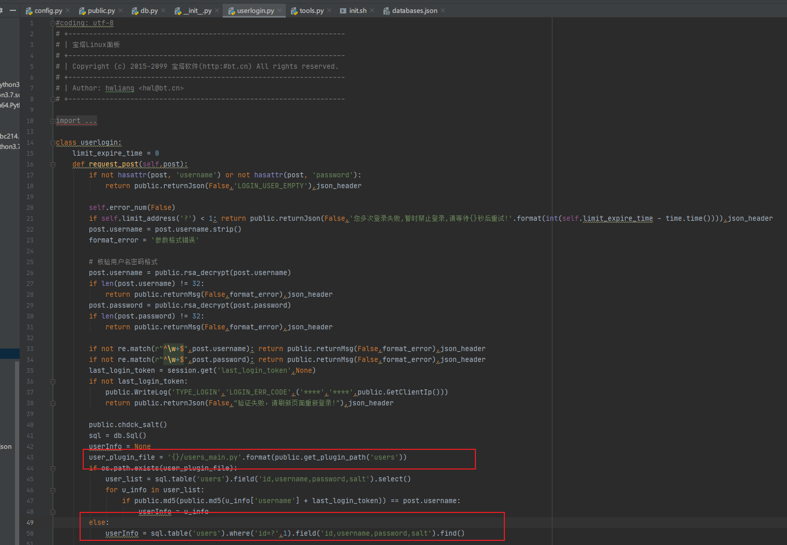
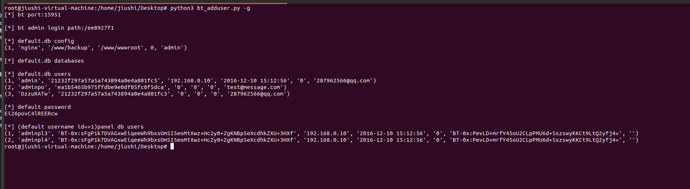
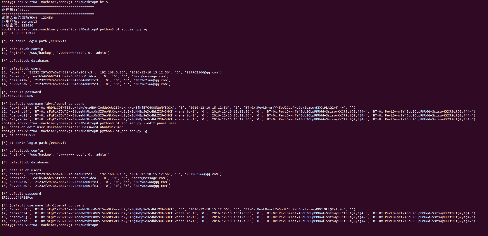
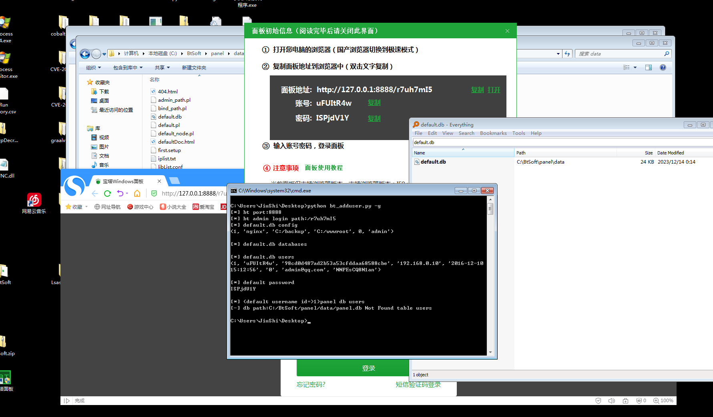
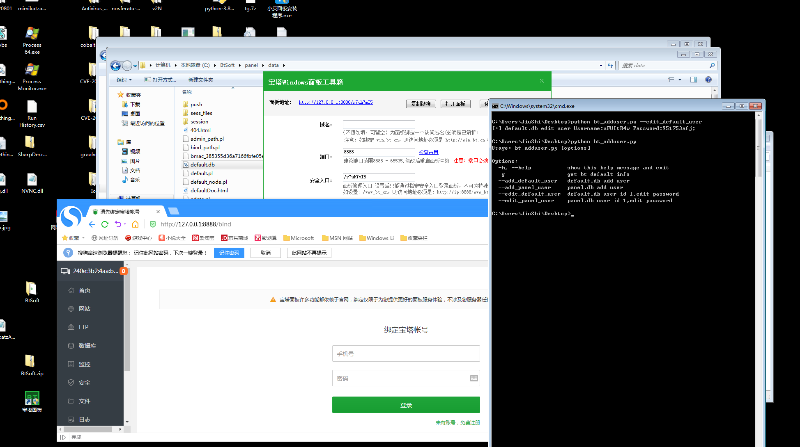

## 宝塔添加用户 ##
```text
后台路径:
C:/BtSoft/panel/panel/data/admin_path.pl
/www/server/panel/data/admin_path.pl

初始默认密码:
C:/BtSoft/panel/data/default.pl
C:/BtSoft/panel/panel/data/a_pass.pl

/www/server/panel/data/a_pass.pl
/www/server/panel/data/default.pl

宝塔的登录端口:
C:/BtSoft/panel/data/port.pl
/www/server/panel/data//port.pl

登录账号：
C:/BtSoft/panel/panel/data/default.db(账号和加密的密码)
C:/BtSoft/panel/panel/data/panel.db

/www/server/panel/data/db/default.db
/www/server/panel/data/db/panel.db
```

省流:
```text
win -default.db
INSERT INTO users (id,username,password,login_ip,login_time,phone,email,salt)  VALUES ({lastid+1},"{username}","ea1b5465b975ffdbe9e0df05fc0f5dca",0,0,0,"test@message.com","Vf0JoGbf4wg5")
update users set password="ea1b5465b975ffdbe9e0df05fc0f5dca" where id=1
update users set salt="Vf0JoGbf4wg5" where id=1

Linux - panel.db
INSERT INTO users (id,username,password,login_ip,login_time,phone,email,salt)  VALUES ({lastid},"{username}","BT-0x:sFgP1k7DVAGxwEiqeeWh9bxsOmSI5eoMtXwz+Hc2y0+ZgKNBpSeXcdhkZXU+3HXf","0","2016-12-10 15:12:56","0","BT-0x:PevLD+mrfY45oU2CLpPMU6d+SszswyKKCt9LtQ2yfj4=","")
update users set password="BT-0x:sFgP1k7DVAGxwEiqeeWh9bxsOmSI5eoMtXwz+Hc2y0+ZgKNBpSeXcdhkZXU+3HXf" where id=1
update users set salt="" where id=1
```


注意:  
当管理者没有买多用户管理模块，默认宝塔认证是读取的panel.db(Linux)/default.db(Win),id=1的用户进行登录判断


本地测试结果:
```text
panel.db #Linux BT面板用户管理
default.db #windows BT用户管理
```

tips
```text
Usage: bt_adduser.py [options]

Options:
  -h, --help           show this help message and exit
  -g                   get bt default info
  --add_default_user   default.db add user
  --add_panel_user     panel.db add user
  --edit_default_user  default.db user id 1,edit password
  --edit_panel_user    panel.db user id 1,edit password
```

默认信息获取    


Linux环境测试


windows环境测试    



