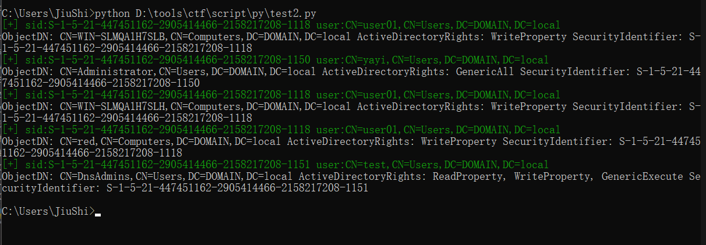

## 使用说明 ##
使用powerview执行
```
Get-ObjectAcl | out-file save.txt
Get-NetUser | out-file user.txt
```

修改文件路径即可
```python
 path=r"C:\Users\JiuShi\Desktop\save.txt"
 path2=r"C:\Users\JiuShi\Desktop\user.txt"
```

需要判断的ACL
```python
self.acls=["GenericAll","GenericWrite","Self-Membership","WriteProperty","WriteOwner","WriteDacl"]
```

Example
