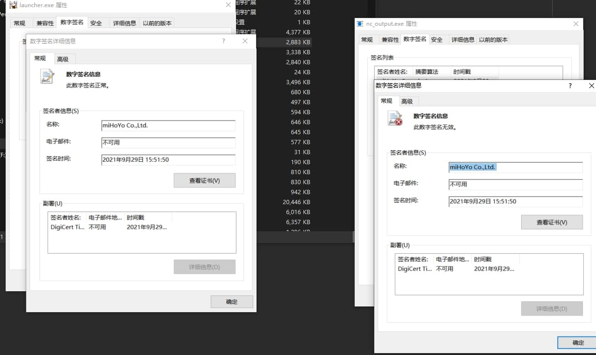
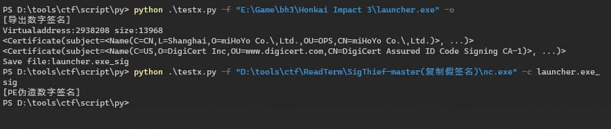
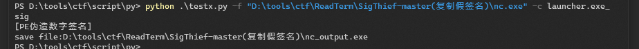

```text
python weizao.py -f "cloudmusic.exe" -o #导出数字签名
python weizao.py -f "nc.exe" -c launcher.exe_sig #伪造数字签名
Usage: weizao.py [options]

Options:
  -h, --help    show this help message and exit
  -f FILE       PE文件
  -o            导出cert文件
  -c CERT_PATH  指定cert文件写入到PE（伪造假签名）
```




