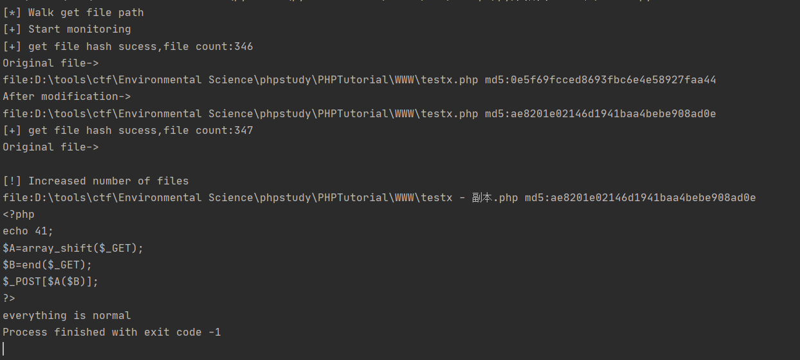
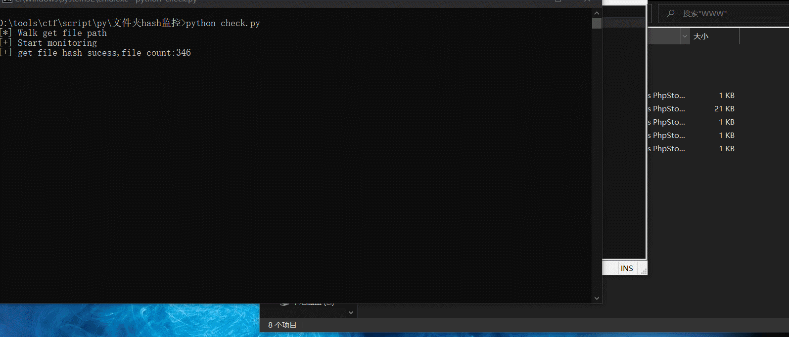

## 文件夹hash值监控 ##
- [x] 急速遍历获取hash
- [x] 变动记录到文件
- [x] 支持配置文件
- [x] 有新文件加入进行提醒并记录hash


config.py
```text
suffix=["php"] #要检查的后缀设置
dirpaths=["D:\\tools\\ctf\\Environmental Science\\phpstudy\\PHPTutorial\\WWW"] #路径设置
thread=5 #线程最大数量
task=200 #任务数量到达一定程度开始并发
check=True #是否开启动态check
save=False #是否开启保存文件
savefilename="savehash.txt" #成功获取hash保存文件名
sleep=5 #动态check循环延时秒数
echo=False #用于配合check开启后是否输出的设置
```



example:


