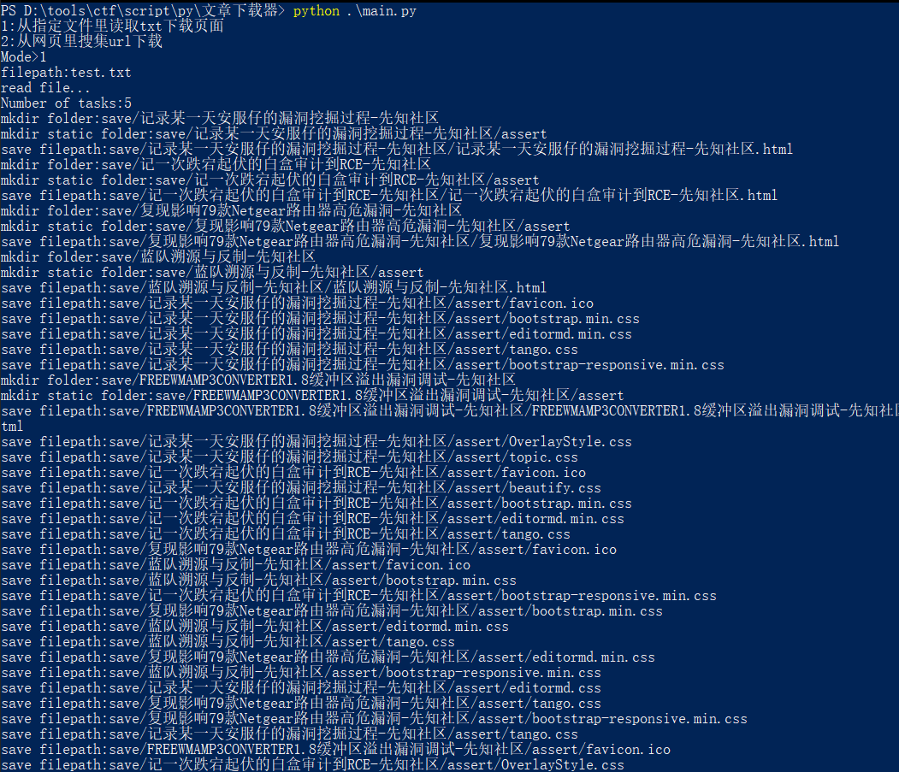
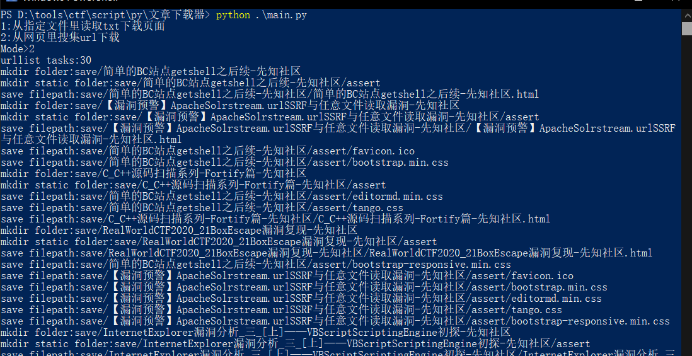
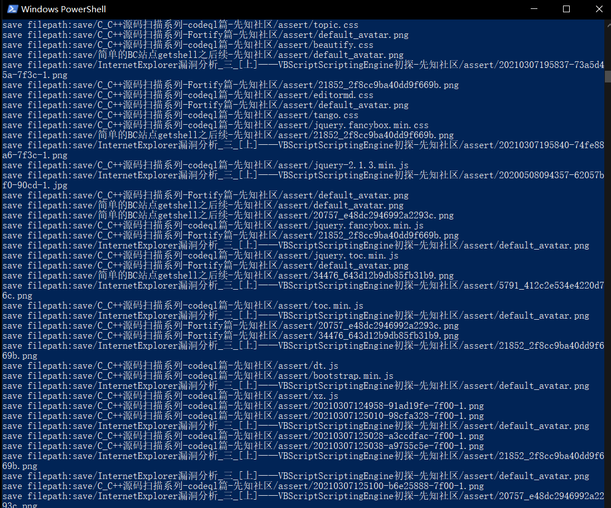
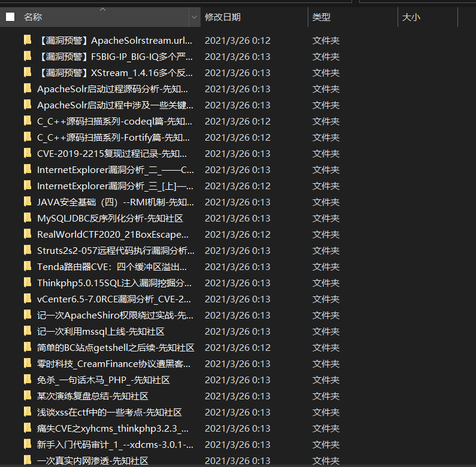
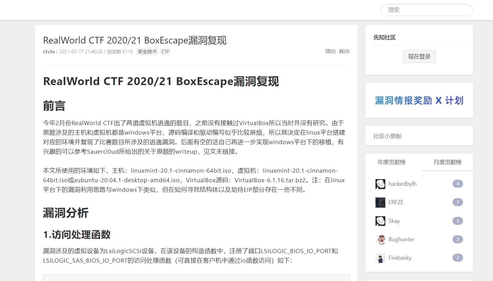

## 文章下载器 ##
### preamble  ###
算是一个临时写的小项目，甚至还不能叫项目。想起之前在某文章看到批量保存网页的（完整保存的），之后一只想写个一样的。后面写了几次不是很满意，这个下午临时写了出来。感觉比较满意

### 食用说明 ###
```
│  config.py #配置文件
│  main.py #主文件
│  README.md
│  test.txt
│
├─plugin #插件目录
│  │  download.py #下载网页主要模块
│  | xianzhidemo.py #demo插件
│
│
├─save #保存下载的目录
```

### config.py ###
```python
from plugin import xianzhidemo
MODE={"1":"从指定文件里读取txt下载页面","2":"从网页里搜集url下载"} #2是预留函数
RESERVE=xianzhidemo.geturl #预留函数定义

REQUEST_CONF={
    "REQUEST_HEADER":{"User-Agent":"Mozilla/5.0 (Windows NT 10.0; Win64; x64) AppleWebKit/537.36 (KHTML, like Gecko) Chrome/89.0.4389.90 Safari/537.36"},
    "TIMEOUT":5,
} #请求配置 (COOKIE也请设置在REQUEST_HEADER里)

#download module配置 (main函数线程池不受DOWNLOAD_MODULE设置所影响)
DOWNLOAD_MODULE=1 #0为单线程,1为多进程
PROCESS=5 #进程限制大小 （要求DOWNLOAD_MODULE为1）
```

这里比较要注意的是RESERVE
选择2的自定义函数（根据自己来获取url，返回url列表），对应main.py的customize函数
```python
    def customize(self):
        #预留函数调用处
        func=config.RESERVE
        urllist=func("https://xz.aliyun.com/?page=2") #返回要被爬取的url列表
        print("urllist tasks:{}".format(len(urllist)))
        with ProcessPoolExecutor(max_workers=config.PROCESS) as process:
            process.map(download.download, urllist, chunksize=1)
```

整个过程:
 1. 从自定义函数/文件获取要爬取的url列表
 2. 送入plugin/download获取html源码
 3. 分开下载静态文件:css、js、png（默认对:link、script、img标签做了提取和处理）
 4. 修改原有html里的静态文件路径改为本地的静态路径
 
 
 
 
 
 
 
 
 
 
 
 能力有限，会存在一些小bug。可根据自身想法进行修改