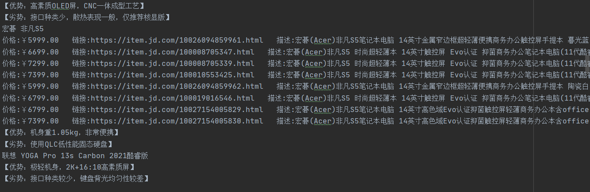

主要用于爬取有关猪王文章里所说的笔记本型号，并从京东里搜索
url示例:https://mp.weixin.qq.com/s/gv4h-fP9tvwk7tjHTzj32Q

config.py
```python
url="https://mp.weixin.qq.com/s/gv4h-fP9tvwk7tjHTzj32Q"
jdurl="https://search.jd.com/Search?keyword={}&enc=utf-8&wq="
jdid=1 #id为1是jd自营，0返回全部
save=0 #save为1为保存，0不保存
filename="out.txt"
```


