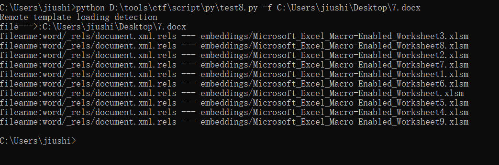
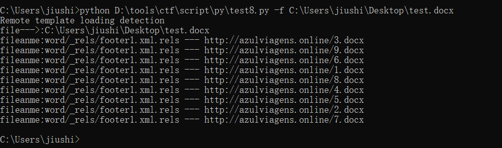

## 远程模板加载检测 ##
```text
Remote template loading detection
Load_detection.py -f test.doc
Usage: Load_detection.py [options]

Options:
  -h, --help  show this help message and exit
  -f FILE     set file
```



