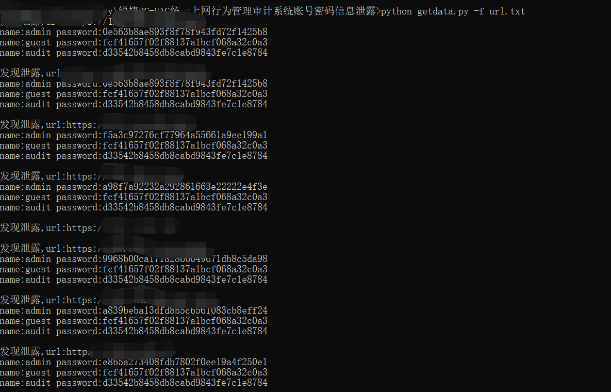

## 锐捷RG-UAC统一上网行为管理审计系统账号密码信息泄露检测 ##
```text
Usage: getdata.py [options]

Options:
  -h, --help  show this help message and exit
  -u URL      检查的url
  -f FILE     待批量检测的url(文件)
python getdata.py -u <url>
python getdata.py -f <file>
```


参考链接:  
[锐捷RG-UAC统一上网行为管理审计系统账号密码信息泄露漏洞 CNVD-2021-14536](https://mp.weixin.qq.com/s/LbSPzt__mKdNN83RhJ2bwA)