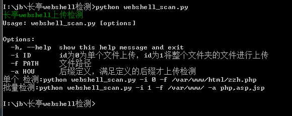
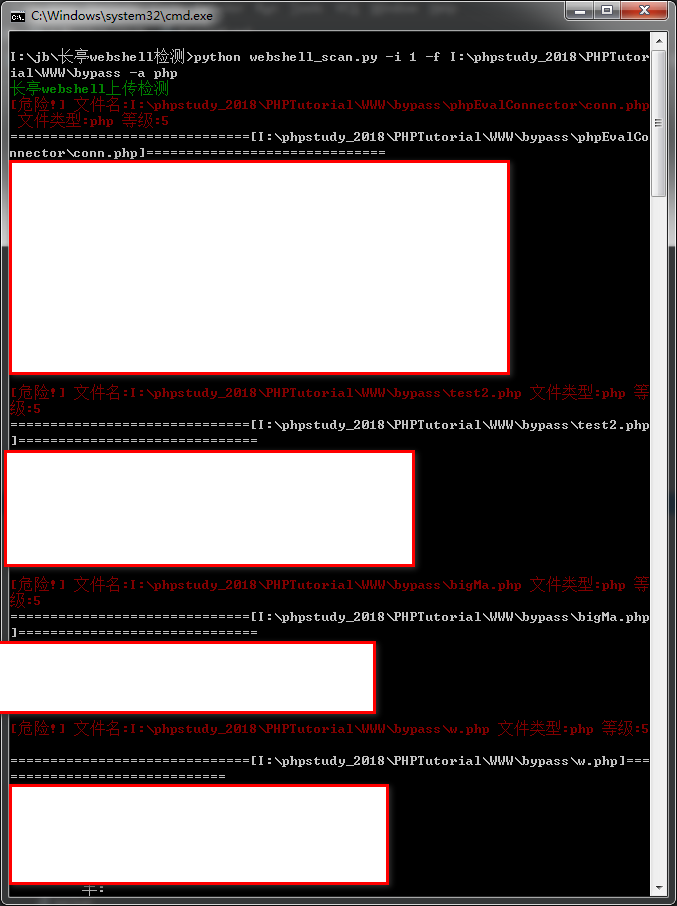
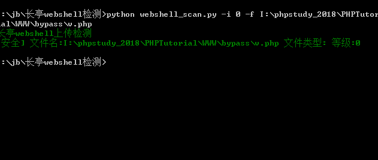

## 长亭webshell上传检测 ##
可更改配置：
```text
31  self.thread=100 #并发满足条件
```

用法：
```text
单个 检测:python webshell_scan.py -i 0 -f /var/www/html/zzh.php
批量检测:python webshell_scan.py -i 1 -f /var/www/ -a php,asp,jsp
```







## 如有有侵权请联系我删除 ##